

# Техническое задание на создание отказоустойчивого майнинг-пула для нескольких криптовалют (Mining pool management system)

## Введение
### Цель документа

Настоящее техническое задание составляется с целью определения требований и условий для разработки, внедрения и эксплуатации майнинг-пула. Документ описывает ключевые аспекты проекта, включая функциональные и технические характеристики системы, требования к оборудованию и программному обеспечению, а также аспекты безопасности и масштабируемости.

Целью разработки майнинг-пула является обеспечение стабильной, безопасной и эффективной платформы для объединения вычислительных мощностей пользователей с целью коллективного добывания криптовалют. Это позволит участникам пула равномерно распределять награду за найденные блоки, обеспечивая справедливость, прозрачность и надежность процесса майнинга.

Документ предназначен для разработчиков, системных администраторов, специалистов по информационной безопасности и других заинтересованных сторон, участвующих в создании и эксплуатации майнинг-пула.

## Область применения

Разрабатываемый майнинг-пул предназначен для частных майнеров, профессиональных майнинг-ферм, а также предприятий, занимающихся добычей криптовалют. Он будет использоваться для коллективного майнинга цифровых активов с целью увеличения стабильности доходов и равномерного распределения вознаграждений между участниками.

Программный продукт применяется в среде распределенных вычислений. Доступ к пулу осуществляется через интернет, что позволяет использовать его в любой географической точке при наличии соответствующих вычислительных мощностей и подключения к сети.

Основными пользователями системы являются:

 - Владельцы частных и корпоративных майнинг-устройств (ASIC, GPU-фермы);
 - Операторы крупных  майнинг-центров;
 - Разработчики и администраторы, обеспечивающие техническую поддержку и эксплуатацию пула;
 - Финансовые аналитики и инвесторы, заинтересованные в прогнозировании доходности майнинга. 
 
Майнинг-пул ориентирован  на обеспечение высокой производительности, отказоустойчивости и безопасности, что делает его применимым, как для небольших групп энтузиастов, так и для крупных майнинговых объединений.

## 1. Общие требования
   ### 1.1 Цель разработки
   Целью разработки майнинг-пула является создание высокопроизводительной, надежной и безопасной платформы для коллективного майнинга криптовалют. Система должна обеспечить объединение вычислительных мощностей пользователей, оптимизацию распределения задач и справедливое распределение вознаграждений среди участников пула.

   Основные задачи, которые решает продукт:

   • **Повышение эффективности майнинга** – надежная, бесперебойная связь с пулом, снижение вероятности случайных потерь награды за счет совместного поиска блоков.  
   • **Обеспечение стабильного дохода** – участникам пула предоставляются разные модели начисления вознаграждений за их вклад в работу пула.  
   • **Масштабируемость и отказоустойчивость** – система должна поддерживать большое количество подключенных пользователей и гарантировать бесперебойную работу.  
   • **Безопасность** – защищенные каналы обмена данными (TLS), обеспечение целостности данных, прозрачные и надежные механизмы платежей.  
   • **Простота использования** – удобный интерфейс и поддержка различных устройств (ASIC, GPU-фермы, CPU).  

   Разработка майнинг-пула направлена на создание конкурентоспособного решения, способного работать в условиях высокой нагрузки, соблюдая современные требования к производительности, безопасности и прозрачности расчетов.

### 1.2 Пользователи системы
Система майнинг-пула предусматривает несколько категорий пользователей, каждая из которых обладает различными уровнями доступа и функциональными возможностями:

**Администраторы** – управляют работой пула, обеспечивают его техническое обслуживание и безопасность.

- Настройка и мониторинг серверов.
- Управление пользователями и правами доступа.
- Анализ производительности и логирование событий.
- Мониторинг работы майнинговых сервисов в реальном времени.
- Корректировка параметров работы майнинговых серверов.
- Обновление программного обеспечения и реализация мер безопасности.

**Майнеры (конечные пользователи)** – владельцы вычислительных мощностей, участвующие в майнинге.
- Подключение оборудования (ASIC, GPU-фермы, CPU).
- Отслеживание статистики работы (хешрейт, доходность, выполненные шары).
- Получение вознаграждений в соответствии с выбранной моделью выплат.
- Настройка параметров майнинга (выбор алгоритма, кошелька, рабочих узлов).

**Финансовые пользователи** (инвесторы, бухгалтеры, аналитики) – анализируют доходность и управляют финансами.

- Мониторинг доходов и расходов пула.
- Управление выплатами и учет транзакций.
- Анализ эффективности работы оборудования.

**Гости** (неавторизованные пользователи) – могут просматривать общедоступную информацию о пуле.

- Ознакомление с условиями работы пула.
- Просмотр статистики и публичных данных (например, общий хешрейт пула, последние найденные блоки).
- Регистрация и создание учетной записи для пользования сервисами, требующими авторизации.

Каждая категория пользователей имеет определенные права доступа и инструменты для эффективного взаимодействия с системой, что обеспечивает безопасность, удобство и прозрачность работы пула.

### 1.3 Предназначение продукта
Разрабатываемый майнинг-пул предназначен для объединения вычислительных мощностей пользователей с целью совместной добычи криптовалют. Он обеспечивает равномерное распределение награды за найденные блоки среди участников, пропорционально их вкладу, что делает майнинг более предсказуемым и стабильным.

Основные проблемы, которые решает продукт:

- **Нестабильность индивидуального майнинга – одиночные майнеры сталкиваются с высокой волатильностью доходов, поскольку вероятность нахождения блока мала. Пул решает эту проблему, распределяя награды среди всех участников.
• Оптимизация вычислительных мощностей – за счет эффективного распределения задач между подключенными устройствами повышается общая производительность майнинга.
• Упрощение процесса майнинга – пользователи получают удобный инструмент для мониторинга и настройки своего оборудования без необходимости глубоко разбираться в технических аспектах блокчейна.
• Обеспечение безопасности и прозрачности – система защищена от мошенничества и манипуляций с выплатами, обеспечивая честное распределение доходов.
Как будет использоваться продукт:
1. Пользователь регистрируется в системе (если необходимо для использования некоторых услуг), подключает свое оборудование.
2. Система распределяет задачи среди участников и агрегирует результаты.
3. Найденные блоки подтверждаются в блокчейне, и вознаграждение делится согласно установленной схеме распределения наград.
4. Пользователь может отслеживать свою статистику и получать выплаты на указанный кошелек.
Таким образом, майнинг-пул повышает рентабельность и доступность майнинга, позволяя как частным майнерам, так и крупным фермам эффективно использовать свои ресурсы.

### 1.4 Область применения
Майнинг-пул будет использоваться в различных условиях, где есть доступ к вычислительным мощностям и интернет-соединению. Его основная область применения включает в себя:

1. **Майнинг-фермы** – крупные объекты с высокоскоростными вычислительными мощностями, ориентированные на добычу криптовалют. Пул обеспечит эффективное объединение мощностей разных фермеров и оптимизацию их работы.
2. **Частные майнеры** – индивидуальные пользователи, которые используют свои вычислительные ресурсы (например, ASIC-устройства или GPU-фермы) для участия в коллективном майнинге.
3. **Дата-центры** – профессиональные компании, предоставляющие хостинг и облачные вычисления, которые могут использовать пул для объединения своих ресурсов и более эффективного майнинга.
4. **Криптовалютные стартапы и исследовательские проекты** – организации, которые могут использовать майнинг-пул как средство для тестирования и разработки новых алгоритмов и технологий.

Майнинг-пул может функционировать в условиях постоянного интернет-соединения и в любом месте, где доступна соответствующая вычислительная инфраструктура (серверы, майнинговые установки, дата-центры). Продукт также можно использовать в разных географических регионах, обеспечивая доступ к участникам по всему миру.

Кроме того, продукт будет востребован в условиях активного развития криптовалютных рынков, что предполагает его использование как для крупных коммерческих проектов, так и для отдельных пользователей, заинтересованных в стабилизации и увеличении своих доходов от майнинга.

### 1.5 Описание системы
Майнинг-пул представляет собой распределенную вычислительную систему, предназначенную для объединения вычислительных мощностей участников с целью совместного майнинга криптовалют. Основной задачей системы является эффективное распределение работы между подключенными участниками, а также справедливое распределение вознаграждений за выполненные вычисления.

В пуле используется Proof of Work (PoW) алгоритм консенсуса для подтверждения транзакций и защиты сети от атак. Майнеры (участники сети) выполняют сложные вычисления, чтобы доказать, что они потратили определённые вычислительные ресурсы на обработку данных.

## 2. Архитектура системы
   ### 2.1 Общая концепция архитектуры
   - Проект должен быть построен с использованием микросервисного подхода.  
   - Высоконагруженные узлы, отвечающие за вычисления должны быть масштабируемыми – при росте нагрузки иметь механизм для быстрого добавления мощностей в полуавтоматическом, а в перспективе и в полностью автоматическом режиме.
   - Компоненты системы должны быть отказоустойчивыми – при выходе из строя вычислительного узла поток запросов должен перенаправляться на рабочие узлы. Данные должны храниться в отказоустойчивых кластерах, чтобы при выходе из строя одного из узлов кластера данные не были потеряны.
   - Взаимодействие между микросервисами, а также запросы от пользователей должно вестись по защищенным протоколам (TLS, JWT токены)
   - Микросервисный подход в выборе архитектуры выбран по следующим причинам:
    
     - Специфика майнинга изначально подразумевает размещение серверов в нескольких географических зонах. Каждая криптовалюта имеет свою специфику – значит для каждой криптовалюты нужно разработать свой микросервис по решению задач генерации заданий, приему и проверки решений от майнеров.
     - Мы изначально планируем размещать сервера в трех географических зонах (Европа, Азия, Америка), то есть на каждую криптовалюту необходимо минимум три сервера, а при, например, пяти криптовалютах – 15 серверов.
     - В зависимости от метода вычисления вознаграждений (а их запланировано минимум три) в рамках одной криптовалюты будет несколько реализаций алгоритма подсчета наград. Для всех криптовалют методы вычисления наград работают в принципе одинаково (возможно с мелкими вариациями), поэтому имеет смысл вынести функционал вычисления вознаграждений в отдельный микросервис.
     - Три географические зоны, пять криптовалют, три метода вычисления вознаграждений дает 45 отдельных конфигурационных файлов, что влечет за собой необходимость реализации механизма централизованного изменения конфигураций.
     - При таком количестве серверов очень трудно следить за актуальностью адресов и портов для каждого микросервиса – необходима какая-то служба обнаружения сервисов (Service Discovery).
     - От такого количества серверов постоянно идет огромный поток данных, которые нужно где-то агрегировать, а потом строить различные выборки по накопленным данным. Из-за потенциально большого количества данных на добавление, а также для обработки миллионов записей в запросе традиционная реляционная база данных не подходит. Поэтому имеет смысл такие данные хранить в аналитической базе данных (ClickHouse) и вынести функционал работы с ней в отдельный микросервис.
     - Также выносим данные по майнерам и воркерам в отдельный микросервис. Он будет использоваться как справочник для остальных микросервисов, а также будет хранить актуальные характеристики работы воркеров и отдавать их пользователям.
     - Серверов для майнинга отдельной криптовалюты может быть много, но сервис платежей по этой криптовалюте нужен только один. Поэтому его тоже выносим в отдельный микросервис. К тому же этот сервис не подразумевает высоких нагрузок, поэтому для его работы можно использовать слабый сервер или даже можно разместить эту службу на одном сервере с другими микросервисами.
     - Также логично выделить отдельный микросервис для рассылки уведомлений о происходящих в системе событиях. Эти уведомления могут рассылаться как пользователям, так и администраторам. Уведомления могут иметь как штатный характер – для отображения текущих параметров работы воркеров, найденных шарах, блоках и т.д., так и алерты для администратора при возникновении критических событий: аномальная нагрузка, падение сервиса, заканчивающееся место на диске и тому подобное.
     - Работы по регистрации и авторизации пользователей также выносим в отдельный микросервис.
     - Для управления входящими запросами к микросервисам в этой распределённой системе необходим отдельным микросервис API Gateway. Он выполняет роль единой точки входа для клиентов (мобильных приложений, веб-приложений, других сервисов) и распределяет запросы между бэкенд-сервисами. Может использоваться для балансировки нагрузки, аутентификации  и авторизации, кеширования, мониторинга и логирования, огранияения количества запросов (Rate Limiter), а также для маршрутизации и агрегирования запросов к нужным микросервисам.

### 2.2 Основные принципы построения микросервисной архитектуры проекта
**Декомпозиция на независимые сервисы**

- Каждый микросервис выполняет одну конкретную бизнес-задачу (принцип единственной ответственности).
- Разделение по доменным областям (DDD – Domain-Driven Design).

**Слабая связанность и автономность**
- Каждый сервис разрабатывается, разворачивается и масштабируется независимо от других.
- Минимизация зависимостей между сервисами.

**Обмен данными через API**
- Взаимодействие микросервисов происходит через REST API, gRPC, WebSockets, а также через очереди сообщений (Kafka, RabbitMQ).
- Использование стандартных протоколов (JSON, Protobuf).

**Разделенные хранилища данных**
- Каждый микросервис управляет своей собственной базой данных (NoSQL, SQL).
- Исключается прямая зависимость между сервисами через общую БД.

**Автоматизированное развертывание и оркестрация**
- Ansible для простой и удобной автоматизации без сложных инструментов.
- Использование контейнеризации (Docker, в перспективе Kubernetes).
- CI/CD-пайплайны для автоматического деплоя и обновления сервисов (Gitlab CI).

**Масштабируемость и отказоустойчивость**
- Возможность горизонтального масштабирования отдельных сервисов (сервера генерации заданий и проверки решений).
- Отказоустойчивые кластеры баз данных (PostgreSQL, ClickHouse, etcd) и очередей сообщений (Kafka, RabbitMQ)

**Мониторинг и логирование**
- Централизованный мониторинг (Prometheus, Grafana).
- Логирование (EFK Stack – Elasticsearch, Fluentbit, Kibana)
- Трассировка запросов (OpenTelemetry, Otel Collector, Grafana Tempo, Grafana).

**Безопасность и аутентификация**
- Использование API Gateway для маршрутизации и защиты сервисов.
- Аутентификация через JWT.
- Использование защищенных TLS соединений

### 2.3 Логическая архитектура

Очень упрощенная схема логической архитектуры выглядит как на рисунке ниже:

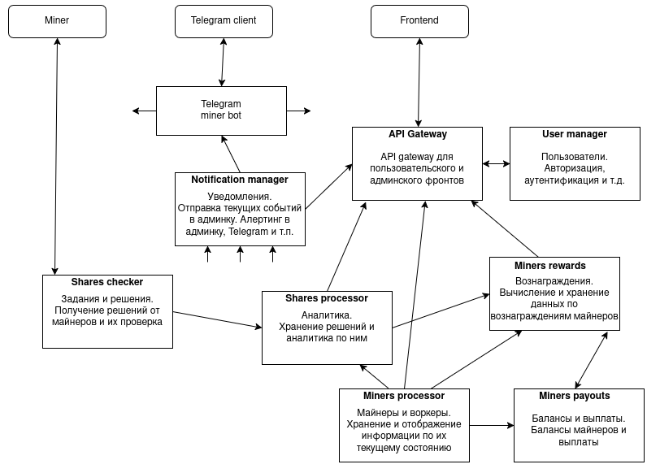

Стрелками обозначено направление движения данных.

Майнер подключается к микросервису **Share checker** получает задание и отправляет решение (шару).  Далее данные шар накапливаются в **Share processor** откуда могут быть запрошены пользователем через **API Gateway** или же быть использованы при подсчете вознаграждения в **Miners rewards** после нахождения блока.

После подтверждения блока служба **Miners rewards** обменивается данными с **Miners payouts** для начисления средств на балансы майнеров. При достижении порогового значения служба **Miners rewards** производит выплаты майнерам.

Все службы могут генерировать уведомления, которые с помощью **Notification manager** рассылаются нужным адресатам.

Также для некоторого функционала может быть необходима авторизация пользователя – для этих целей есть служба **User manager**.

### 2.4 Физическая архитектура
Все компоненты системы размещаются на VDS серверах. В перспективе инфраструктурные компоненты (базы данных, брокеры сообщений и т.п.) можно будет размещать в облаке.

#### 2.4.1. API Gateway
- **Роль:** Обработка HTTP/HTTPS запросов от клиентов (пользователи и администраторы) и  распределяет запросы между бэкенд-сервисами.
- **Технологии**: Golang, TLS, JWT, REST, Websocket
- **Размещение**: виртуальный выделенный сервер (VDS). Для отказоустойчивости можно развернуть несколько экземпляров API Gateway за балансировщиком HAProxy. В свою очередь при таком варианте HAProxy сам станет точкой отказа, поэтому можно использовать еще один HAProxy в качестве резервного и переключаться между основным и резервным с помощью DNS-based Failover решения у провадера DNS.
- **Масштабирование:** При повышении нагрузки можно добавлять сервера с API Gateway, а HAProxy настроить на равномерное распределение запросов между этими серверами. Но вариант, когда API Gateway перестанет справляться маловероятен конечно.

#### 2.4.2. Kafka кластер с высокой доступностью
- **Роль:** прием потока шар от майнинг серверов и передача их в сервис обработки и хранения шар, сбор логов и метрик со всей системы и доставки их потребителям, другой обмен данными с микросервисами по модели издатель-подписчик.
- **Технологии:** Apache Kafka, Zookeeper, UI for Kafka.
- **Размещение:** кластер из трех VDS с репликацией (или развертывание в облаке в разных зонах доступности) для высокой доступности и отказоустойчивости.
- **Масштабирование:** для масштабирования добавляем больше брокеров в кластер.

#### 2.4.3. RabbitMQ кластер с высокой доступностью
- **Роль:** гарантированная доставка критических данных (данные найденного блока, данные по начислениям вознаграждений) в условиях невысокой планируемой нагрузки (в отличии от Kafka с его потоками данных)
- **Технологии:** RabbitMQ
- **Размещение:** кластер из трех VDS с репликацией очередей (или развертывание в облаке в разных зонах доступности) для высокой доступности и отказоустойчивости.
- **Масштабирование:** добавление нового узла в кластер.

#### 2.4.4. Отказоустойчивый PostgreSQL кластер
- **Роль:** хранение данных микросервисов (майнеры, воркеры, пользователи, блоки, вознаграждения, балансы, выплаты)
- **Технологии:** HAProxy, etcd, PostgreSQL, pgBouncer, Patroni.
- **Размещение:** отказоустойчивый кластер из трех VDS с репликацией, выбором лидера, восстановлением после сбоев.
- **Масштабирование:** при увеличении нагрузки на чтение, можно просто добавлять ноды-реплики только для чтения (HAProxy служит балансировщиком нагрузки на read-only реплики). Также можно подумать над шардированием или же просто разделить базу данных по криптовалютам. То есть делать отдельный кластер для каждой криптовалюты.

#### 2.4.5. ClickHouse кластер
- **Роль:** хранение аналитических данных (используется для хранения данных шар и выполнения агрегационных запросов к ним). При потенциальном потоке данных в тысячи записей в секунду нужна СУБД  с высокой скоростью вставки и возможностью быстрых выборок по большому числу записей.
- **Технологии:** ClickHouse, Zookeeper
- **Размещение:**  отказоустойчивый кластер из трех VDS (или развертывание в облаке)
- **Масштабирование:** добавление новых серверов в кластер, шардирование (sharding) и репликация данных.

#### 2.4.6. Блокчейн нода
- **Роль:** хранение полной копии блокчейна (все блоки и транзакции), проверка их корректность, создание новых блоков, проверка новых транзакций и блоков на соответствие правилам сети, поддержание целостности блокчейна, распространение проверенных данных другим нодам.
- **Технологии:** зависят от каждой конкретной криптовалюты
- **Размещение:** на отдельном VDS
- **Масштабирование:** простое добавление нового сервера

#### 2.4.7. ETCD кластер
- **Роль:** распределенной хранилище для хранение конфигураций микросервисов, обнаружение сервисов (Service Discovery), Patroni storage (для PostgreSQL кластера)
- **Технологии:** etcd, etcd-keeper
- **Размещение:** кластер с нечетным количеством узлов-VDS в разных зонах доступности.
- **Масштабирование:** не предназначен для хранения больших объемов данных, достаточно 3-5 узлов.

#### 2.4.8. Shares checker микросервис
Майнинг сервер (майнинг пул, микросервис формирования задач для майнеров и проверки решений от них)

- **Роль:** Golang микросервис, разработанный под конкретную криптовалюту, получает задачу из блокчейн ноды, дробит ее на подзадачи и распределяет их между майнерами. Получает от майнеров решения, проверяет их и передает в микросервис обработки и хранения.
- **Технологии:** Golang, Redis, Nginx, Fluentbit, Kafka, RabbitMQ, Stratum, Blockchain API
- **Размещение:** один VDS – один микросервис. Как правило должен размещаться на одном сервере с блокчейн нодой для минимизации сетевых задержек.
- **Масштабирование:** при увеличении количества подключений можно добавлять сервера в разные географические зоны. Например, имея на старте сервера в Европе, Азии и Северной Америке, можно добавить сервера в Южной Америке, России, Казахстане и т.д. В случае очень большого наплыва пользователей в конкретной географической зоне можно добавить рядом несколько серверов и перед ними поставить балансировщик HAProxy, равномерно распределяющий запросы по этим серверам.

#### 2.4.9. Shares processor микросервис
- **Роль:** Golang микросервис дял получения потока решений от майнеров, сохранение их в базу, формирование агрегированных данных для пользователей и для формирования массива данных для расчета вознаграждений.
- **Технологии:** Golang, Kafka, Clickhouse, gRPC, REST
- **Размещение:** один VDS – один микросервис. Размещается на одном сервере с Clickhouse нодой, куда и будет вести запись/чтение.
- **Масштабирование:** можно рядом с каждой Clickhouse нодой разместить по микросервису, каждый из которых забирает из очереди только свои данные по какой-то криптовалюте. Можно также подумать над отдельным сервисом балансировщиком.

#### 2.4.10. Miners processor микросервис
- **Роль:** Golang микросервис для работы с данными майнеров и воркеров. Заведение новых майнеров и воркеров в базе, выдача данных по ним по внешним запросам. Хранение текущих параметров работы майнеров/воркеров.
- **Технологии:** Golang, PostgreSQL, Kafka, gRPC, REST
- **Размещение:** VDS сервер
- **Масштабирование:** добавление нескольких экземпляров + балансировщик HAProxy

#### 2.4.11. Miners rewards микросервис
- **Роль:** Golang микросервис для обработки найденных блоков, вычисления и хранения вознаграждений за блок.
- **Технологии:** Golang, PostgreSQL, RabbitMQ, gRPC, REST
- **Размещение:** VDS сервер
- **Масштабирование:** Микросервис ненагруженный, поэтому можно просто держать резервный на случай выхода основного из строя.

#### 2.4.12.  Miners payouts микросервис
- **Роль:** Golang микросервис для осуществления выплат. Отдельная разработка для каждой криптовалюты.
- **Технологии:** Golang, PostgreSQL, Kafka, RabbitMQ, gRPC, REST, Blockchain API
- **Размещение:** VDS сервер. Отдельный или один из серверов с Shares checker
- **Масштабирование:** на каждую криптовалюту свой микросервис. Микросервис ненагруженный, поэтому можно просто держать резервный на случай выхода основного из строя.

#### 2.4.13.  Notification manager микросервис
- **Роль:** Golang микросервис для рассылки уведомлений. При возникновении событий о которых необходимо уведомить пользователя или администратора такие события пишуться в очередь Kafka, откуда их потом забирает этот сервис и рассылает нужным получателям, в зависимости от типа уведомления. Алерты – в Telegram администратору или подписанному пользователю, мониторинг – в фронтенд админку через Websocket и т.п.
- **Технологии:** Golang, PostgreSQL, Kafka, gRPC, Websocket, Telegram Bot API
- **Размещение:** VDS сервер.
- **Масштабирование:** добавляем сервер + экземпляр микросервиса. Микросервис добавляем в группу подписчиков на нужные топики Kafka.

#### 2.4.14.  User manager микросервис
- **Роль:** для некоторых действий (реферальная программа, дополнительный функционал) может понадобиться регистрация и авторизация пользователей. Этот сервис как раз для этого.
- **Технологии:** Golang, PostgreSQL, JWT
- **Размещение:** один из VDS серверов.
- **Масштабирование:** на начальном этапе не требуется

#### 2.4.15.  Telegram miner bot микросервис
- **Роль:** дополнительный инструмент наблюдения за майнингом для пользователей. Просмотр балансов кошельков, статусов воркеров, подсчет доходов, уведомления об отключениях воркеров, прочие оповещения.
- **Технологии:** Golang, PostgreSQL, Telegram bot API
- **Размещение:** один из VDS серверов.
- **Масштабирование:** на начальном этапе не требуется

#### 2.4.16.  EFK - сбор, обработка и визуализация логов
- **Роль:** сбора и обработки логов, их храненние и индексация, веб-интерфейс для визуализации данных логов (поиск и фильтрация, анализ, графики и диаграммы)
- **Технологии:** Elasticsearch, Fluentbit, Kibana, Logstash
- **Размещение:** один или несколько VDS серверов.
- **Масштабирование:** Elasticsearch – добавление нового узла в кластер, Kibana – дополнительный экземпляр + балансировщик HAProxy.

#### 2.4.17.  OpenTelemetry - сбор, обработка и визуализация метрик и трейсов
- **Роль:** Сбор, хранение и анализа метрик получаемых с серверов и от микросервисов.  Сбор, хранение и анализ распределённых трассировок (distributed traces) - отслеживание путей запросовв микросервисах, их анализ, диагностирование ошибок.
- **Технологии:** Prometheus, Grafana, OpenTelemetry Collector, Grafana Tempo
- **Размещение:** один или несколько VDS серверов.
- **Масштабирование:**  
  - **Prometheus** изначально разработан как система с однопоточным сбором метрик, но при высоких нагрузках или в крупных кластерах можно распределить эту нагрузку между несколькими экземплярами Prometheus. Можно применить шардирование - разделение инфраструктуры на части, где каждый Prometheus-экземпляр собирает метрики только с определенного подмножества целей.
  - **Tempo** можно запускать как несколько независимых экземпляров, каждый из которых будет обрабатывать часть входящих трассировок.

  - **Otel Collector** - основной способ масштабирования - запуск нескольких экземпляров Otel Collector. Каждый экземпляр работает независимо и обрабатывает часть входящих данных.

Каждый указанный выше микросервис может размещаться как на отдельном VDS сервере, так и в комбинации с другими компонентами (для минимизации затрат) на одном VDS сервере в зависимости от планируемой нагруженности.

Инфраструктурные компоненты (кластера Postgresql, etcd, Clickhouse, Kafka, RabbitMQ, OpenTelemetry) при небольших начальных нагрузках, тоже могут быть размещены по соседству на одном VDS сервере ради экономии средств на начальном этапе функционирования системы.

### 2.5 Программная архитектура
Программная архитектура системы описывает структуру программного обеспечения, основные компоненты, их взаимодействие и технологии, используемые для реализации функциональности. Архитектура системы построена на основе микросервисной архитектуры, что обеспечивает гибкость, масштабируемость и легкость поддержки.

#### 2.5.1 Общая схема проекта

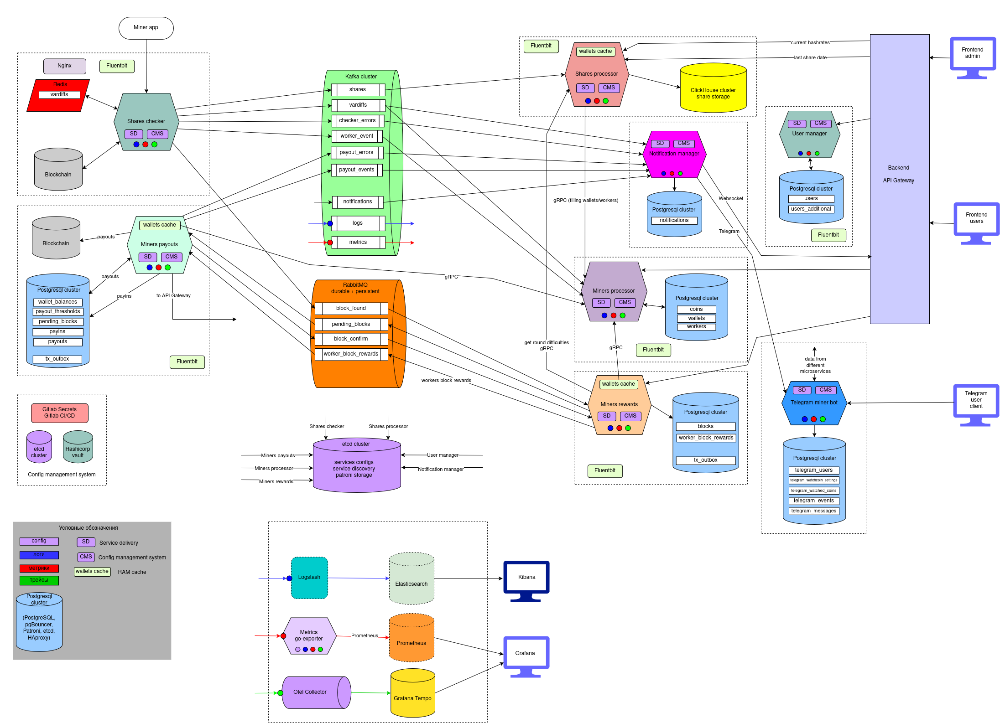

В высоком разрешении на [этой странице](https://laradrom.ru/struktura-i-komponenty-majning-pula/).

Пояснения к условным обозначениям:

- **Пунктирной рамкой** очерчены логические компоненты системы (микросервисы).
- **Шестиугольниками** разных цветов обозначены непосредственно бинарники микросервисов (Golang программы) – то, что собственно и реализует программист.
- **Стрелками** обозначены связи между компонентами: запросы, команды, потоки данных.
- **Значки внутри шестиугольников** обозначают внутренние подсистемы в программе, отвечающие за определенный функционал:
  - **SD** – Service Discovery. Все микросервисы пользуются механизмом обнаружения сервисов, то есть других микросервисов с которыми они взаимодействуют.
  - **CMS** – Config Management System. Все микросервисы загружают свою конфигурацию из отказоустоучивого кластера etcd.
  - **синий круг** – микросервис пишет логи в систему логирования
  - **красный круг** – микросервис пишет метрики в систему сбора метрик
  - **зеленый круг** – микросервис пишет трейсы систему в сбора, хранения и запроса трейсов
  - **wallets cache** – кеш данных майнеров и воркеров в оперативной памяти программы

- **Значок монитора** – означает пользовательский интерфейс.
- **Цилиндр** – база данных. Подразумевается отказоустойчивый кластер.
- **Подписанные прямоугольники в цилиндрах** – названия основных таблиц в базе.
- **Цилиндр на боку** (труба) – очередь сообщений.
- **Подписанные прямоугольники в цилиндрах на боку** – названия топиков или очередей.
- **Fluentbit** – агент сбора логов.

#### 2.5.2 Клиентская часть

- **Frontend users** (Фронтенд пользователя). 
  - **Описание:** SPA приложения на Vue.js. Веб-приложение в браузере. Асинхронная подгрузка данных через API Gateway через AJAX/Fetch API и WebSocket.   
Страница в интернете, где майнеры просматривают текущее состояние пула, статистику работы своих воркеров, найденные блоки, распределение наград за найденный блок, параметры подключения и т.д.
  - **Технологии:** Vue.js (Javascript), HTML, CSS, REST, Websocket, Nodejs, Vite
  - **Функции:** Отображение пользовательского интерфейса, обработка действий пользователя, отправка запросов на сервер (API Gateway).

- **Frontend admin** (Фронтенд администратора)
  - **Описание:** SPA приложения на Vue.js. Веб-приложение в браузере. Асинхронная подгрузка данных через API Gateway через AJAX/Fetch API и WebSocket.   
   Защищенная паролем страница в интернете, где администратор может в режиме реального времени наблюдать за текущим состоянием майнинг серверов, просматривать балансы, изменять параметры и т.д.
  - **Технологии:** Vue.js (Javascript), HTML, CSS, REST, Websocket, Nodejs, Vite
  - **Функции:** Отображение администраторского интерфейса, отправка запросов на сервер (API Gateway), изменение параметров работы системы и т.д (более подробно в требованиях к админке).

- **Telegram user client**  
  - **Описание:** подписка в Телеграме на Telegram miner bot
  - **Технологии:** Telegram
  - **Функции:** Отображение интерфейса отправки запросов в Telegram боту, отправка запросов в Telegram miner bot микросервис.

#### 2.5.3 Backend API Gateway

  - **Описание:** Обработка HTTP/HTTPS, Websocket запросов от клиентов (пользователи и администраторы) и  распределяет запросы между бэкенд-сервисами.
  - **Технологии:** Golang, TLS, JWT, REST, Websocket
  - **Функции:** 
    - обработка HTTP запросов
    - обработка HTTPS запросов
    - обработка Websocket запросов
    - агрегация данных с нескольких микросервисов в один ответ

#### 2.5.4 Микросервисы
#### 1. Shares checker

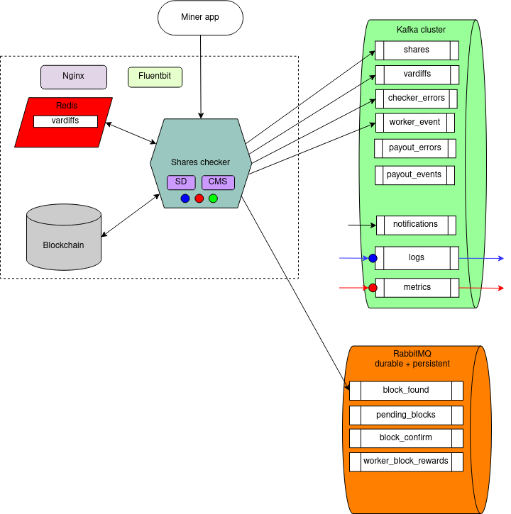

- **Описание:** Воркеры майнеров подключаются к определенным портам приложения и ожидают задачи. Программа через blockchain API (у каждой криптовалюты свой API) получает из ноды криптовалюты задание для решения. Дробит его на более мелкие задачи и рассылает подключенным майнерам. Майнеры ищут решение и при нахождении такого отсылают его обратно. Микросервис проверяет правильность решения. Если решение неверное – отклоняет его, если верное – отправляет в топик Kafka для последующей обработки. При нахождении решения блока – отправляет его в очередь RabbitMQ для дальнейшей обработки другим микросервисом.
- **Технологии:** Golang, Redis, Nginx, Fluentbit, Kafka, RabbitMQ, Stratum, Blockchain API
- **Функции:** 
  - TCP/HTTP сервер принимает входящие подключения воркеров майнера
  - Парсинг команд воркеров (реализация протокола Stratum)
  - Периодическое получение заданий из blockchain ноды через ее Blockchain API
  - Формирование задач майнерам (протокол Stratum)
  - Рассылка задач майнерам
  - Прием и проверка решений майнеров
  - Отправка решений (шар) в топик Kafka
  - Отправка решения блока в очередь RabbitMQ
  - Отправка решения блока в blockchain ноду (Blockchain API)
  - Отправка возникающих ошибок в соответствующий топик Kafka для последующей обработки
  - Отправка событий воркеров в соответствующий топик Kafka (подключение, отключение и т.п.)
  - Каждый микросервис имеет свой доменный адрес, для удобного подключения майнеров. Поэтому используется Nginx для связывает доменного имя с сервером.
  - Динамическая коррекция сложности каждого конкретного воркера для снижения нагрузки на сервер и равномерной выдачи заданий воркеру (vardif).
  - Хранение сложностей воркеров (vardiffs) в кэше Redis для быстрого их получения при подключении воркера и для избежания их потери в момент переподключения воркера. 

#### 2. Shares processor

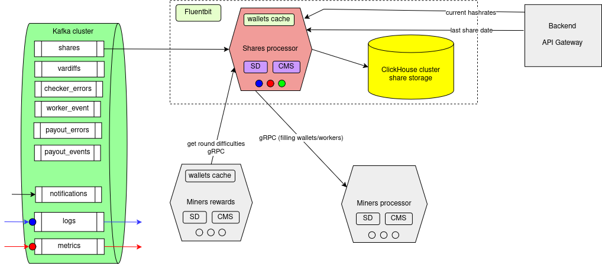

- **Описание:** Микросервис читает поток данных найденных решений (шар) из топика Kafka, нормализует эти данные (сопоставляет названия майнеров/воркеров с их кодами) и сохраняет нормализованные данные в Clickhouse. Принимает и обрабатывает агрегационные запросы с фронтенда (от API Gateway). Формирует данные для микросервиса Miners rewards – массив данных по шарам блока.
- **Технологии:** Golang, Kafka, Clickhouse, gRPC, REST
- **Функции:** 
  - чтение данных шар из топика Kafka
  - сохранение данных шар в Clickhouse
  - запрос данных майнеров/воркеров из микросервиса Miners processor (gRPC)
  - формирование массива данных по блоку по запросу из микросервиса Miners rewards
  - формирование агрегированных данных по запросам с фронтенда: текущие хешрейты воркеров, майнеров и пула в целом; 
  - формирование агрегированных данных для построения графиков хешрейтов воркеров, майнеров и пула
  - поиск даты последней найденной шары для конкретного воркера
  - прочие аналитические запросы

#### 3. Miners processor

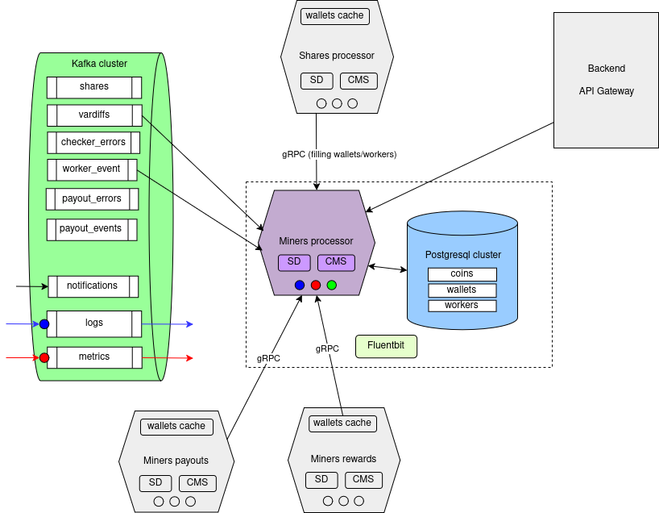

- **Описание:** Микросервис управляющий данными майнеров/воркеров.
- **Технологии:** Golang, PostgreSQL, Kafka, gRPC, REST
- **Функции:**
  - Прием наименований майнеров/воркеров из микросервиса Shares processor (gRPC)
  - Заведение нового майнера/воркера в базе, если его еще там нет (PostgreSQL)
  - Поиск идентификатора майнера/воркера в базе по запросам из внешних микросервисов (Shares processor, Miners rewards, Miners payouts, API Gateway)
  - Получение событий из Kafka, касающихся майнеров и воркеров и их обработка

#### 4. Miners rewards

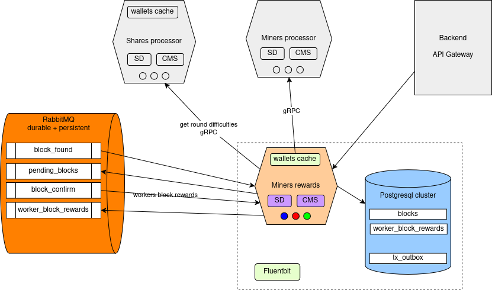

- **Описание:** После нахождения и подтверждения блока микросервис делает запрос к микросервису Shares processor на получение данных по вложенным усилиям каждого майнера по нахождению блока. На основании этих данных, в зависимости от метода вычисления вознаграждений, подсчитывается награда каждого воркера. Данные по наградам заносятся в базу.
- **Технологии:** Golang, PostgreSQL, RabbitMQ, gRPC, REST
- **Функции:**
  - Получение данных по найденному блоку из очереди block_found RabbitMQ
  - Сохранение данных блока в базе PostgreSQL
  - Отправка ожидающего блока в очередь pending_blocks RabbitMQ (Transactional Outbox паттерн)
  - Получение данных подтвержденного блока из очереди block_confirm RabbitMQ
  - Запрос данных по усилиям каждого воркера при нахождении блока из микросервиса Shares processor (gRPC)
  - Вычисление награды каждого майнера/воркера за найденным блок
  - Сохранение данных о наградах в базу PostgreSQL
  - Отправка данных о наградах в очередь worker_block_rewards RabbitMQ
  - Запросы идентификаторов майнеров/воркеров из микросервиса Miners processor (gRPC)
  - Обработка запросов с фронтенда через API Gateway (REST). Данные по распределению наград за блок между майнерами, данные по наградам в разрезе майнера/воркера, данные по найденному блоку.

#### 5. Miners payouts

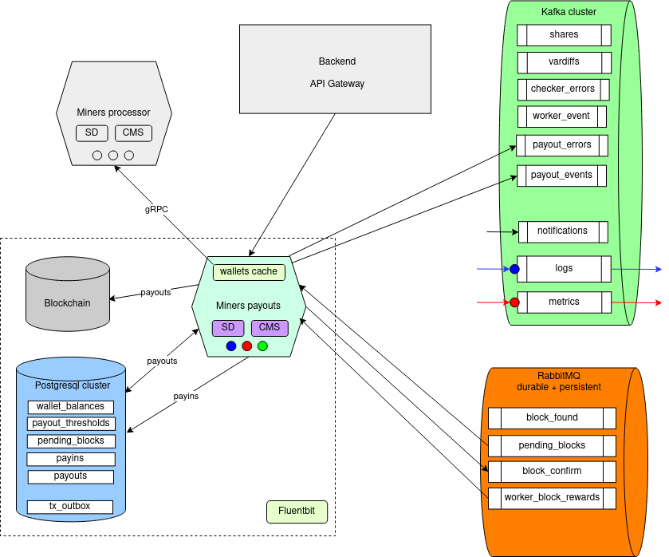

- **Описание:** Формирование балансов майнеров и осуществление выплат на кошельки майнеров.
- **Технологии:** Golang, PostgreSQL, Kafka, RabbitMQ, gRPC, REST, Blockchain API
- **Функции:**
  - Получение из очереди pending_blocks RabbitMQ данных ожидающего подтверждения блока
  - Сохранение ожидающего блока в базе PostgreSQL
  - Периодическая проверка ожидающих блоков на предмет их подтвержденности в blockchain ноде (Blockchain API)
  - После подтверждения блока – отправка данных о подтверждении в очередь block_confirm  RabbitMQ
  - Получение данных о начисленных вознаграждениях из очереди worker_block_rewards
  - Добавление средств на баланс майнеров в базе PostgreSQL согласно полученным данным о вознаграждениях
  - Периодическая проверка балансов майнеров на предмет превышения порогового значения выплаты. При превышении порога – подготовка платежа на кошелек майнера
  - Платеж на кошелек майнера через Blockchain API.
  - Ожидание подтверждения платежной транзакции и отправка подтверждения в топик Kafka
  - Оправка событий по платежам и по ошибкам в соответствующие топики Kafka
  - Получение данных кошельков из микросервиса Miners processor
  - Обработка запросов с фронтенда через API Gateway

#### 6. Notification manager

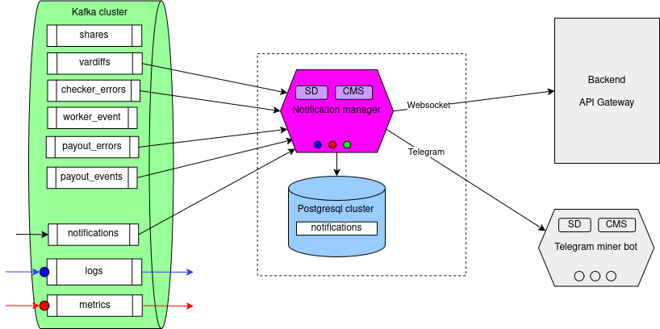
       
- **Описание:** Рассылка уведомлений о событиях пользователям и администратору, трансляция событий в реальном времени на фронтенд пользователя и администратора,   отправка событий и алертов в Telegram
- **Технологии:** Golang, PostgreSQL, Kafka, gRPC, Websocket, Telegram Bot API
- **Функции:** 
  - Чтение событий из топиков Kafka
  - Сохранение событий в базу PostgreSQL
  - Рассылка сообщений о происходящих изменениях через Websocket API Gateway в броузер клиента (текущее усилие добычи, текущий хешрейт, платежи, нахождение блока и т.д.)
  - Рассылка сообщений о происходящих изменениях через Websocket API  Gateway в админку (текущие приходящие шары, статусы серверов, ошибки, алерты и другие характеристики)
  - Рассылка уведомлений и алертов в Telegram боты пользователя (нахождение блока, прерывание работы воркера) и администратора (падение сервера, критическая нагрузка и т.п.)

#### 7. User manager

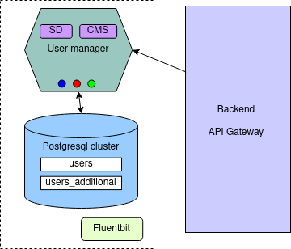

- **Описание:**  регистрация и авторизация пользователей
- **Технологии:** Golang, PostgreSQL, JWT
- **Функции:**
  - регистрация пользователя
  - аутентификация.авторизация пользователя
  - выдача JWT токена

#### 8. Telegram miner bot

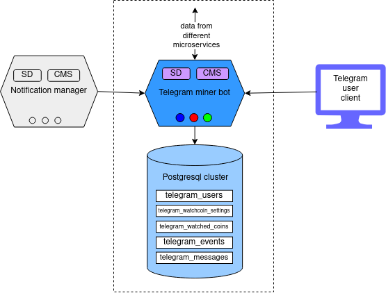

- **Описание:** дополнительный инструмент наблюдения за майнингом для пользователей
- **Технологии:** Golang, PostgreSQL, Telegram bot API 
- **Функции:** 
  - Отправка уведомлений от Notification manager нужному получателю в Telegram
  - Фиксация всех сообщений и событий в базе PostgreSQL
  - Получение данных необходимых для уведомлений из других микросервисов
  - Просмотр балансов кошельков
  - Просмотр статусов воркеров
  - Подсчет доходов
  - Уведомления об отключениях воркеров
  - Прочие оповещения

#### 2.5.5 Базы данных
#### 1. PostgreSQL кластер
Хранение баз данных микросервисов. На общих схемах обозначен синим цилиндром с названиями таблиц. Ниже приведена более подробная схема.

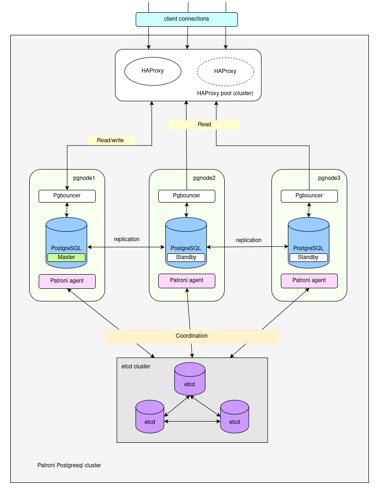

- **HAProxy**  
      Балансировщик нагрузки. Сюда приходят запросы от клиентов. Ставится перед pgBouncer. Отслеживает “здоровье” нод с PostgreSQL и в случаем падения переключает поток запросов на “живую” ноду. Также разделяет потоки на чтение и на запись. Поток на чтение идет на мастер-ноду, на запись – на ноды реплики.

- **pgBouncer**  
      Менеджер подключений  (connection pooler) для PostgreSQL, который оптимизирует работу с базой данных, снижая нагрузку на сервер и ускоряя обработку запросов. Он выступает промежуточным звеном между приложением и PostgreSQL, управляя пулом соединений.  
  **Проблема:**  PostgreSQL создает отдельный процесс для каждого подключения, что потребляет память (до 10 МБ на соединение).  Ограничивает количество одновременных подключений (обычно до 100–1000).   
  **Решение:** pgBouncer повторно использует  соединения, уменьшая количество активных процессов PostgreSQL.  Например, 1000 клиентов могут работать через 10–20 реальных подключений к БД.

- **etcd нода**  
      Распределённое, отказоустойчивое, консистентное хранилище ключ-значение, для управления конфигурацией и координации работы сервисов. Работает в связке с Patroni. Хранит, обновляет и отслеживает изменения конфигурации кластера PostgreSQL в реальном времени.
- **Patroni**  
      Инструмент для управления высокодоступным кластером PostgreSQL. Автоматический failover при сбое мастера. Управление репликацией. Работает в связке с etcd.
  - Зачем нужен Patroni?  
          PostgreSQL из коробки не умеет:   
    - Автоматически переключаться на резервный узел при падении мастера.
    - Динамически управлять репликацией и конфигурацией кластера.
     
  - Patroni заполняет этот пробел, предоставляя:   
    - Автоматический failover (переход на standby-сервер при сбое мастера).
    - Управление репликацией (создание/удаление реплик).
    - Динамическую конфигурацию (изменение параметров на лету).
    - Интеграцию с инструментами мониторинга и оркестрации (Kubernetes, Docker).

  - Как работает Patroni?   
    - Компоненты кластера:   
      - Master (основной узел): Обрабатывает запись данных.
      - Replicas (реплики): Синхронизируются с мастером.
      - DCS (Distributed Configuration Store): Хранит состояние кластера (используются etcd , Consul , ZooKeeper или Kubernetes API ). 
    - Процесс работы:   
      - Patroni на каждом узле постоянно мониторит состояние PostgreSQL.
      - Если мастер недоступен, Patroni инициирует лидерство через DCS.
      - Новый мастер выбирается по приоритету или автоматически.
      - Реплики переконфигурируются для синхронизации с новым мастером. 
          
       
#### 2. etcd кластер

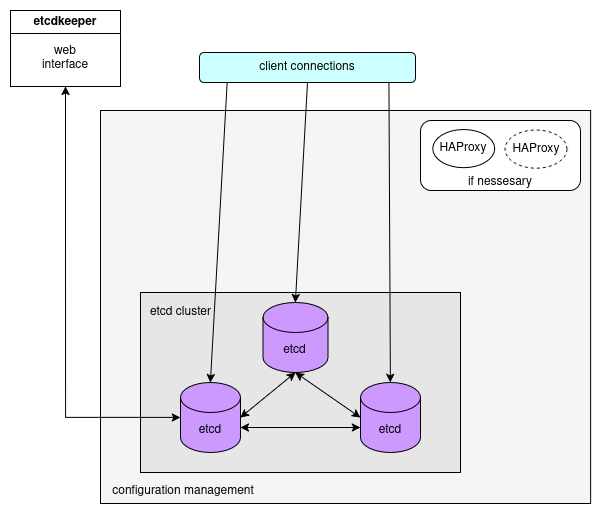

**Описание:** распределенная key-value база данных. Запросы от клиента могут быть направлены к любому узлу. Запросы на запись всегда перенаправляется на лидера (балансировки нет). Клиент может распределять read-запросы между всеми узлами кластера (последовательные чтения). Но линейные чтения всегда идут к лидеру, что создает нагрузку на него. Улучшить балансировку можно настроив HAProxy перед кластером etcd для распределения запросов.

**Технологии:** etcd  

**Функции:** 
1. Хранение конфигураций микросервисов
2. Обнаружение сервисов (Service Discovery)
3. Patroni storage (для PostgreSQL кластера)

#### 3. Clickhouse кластер

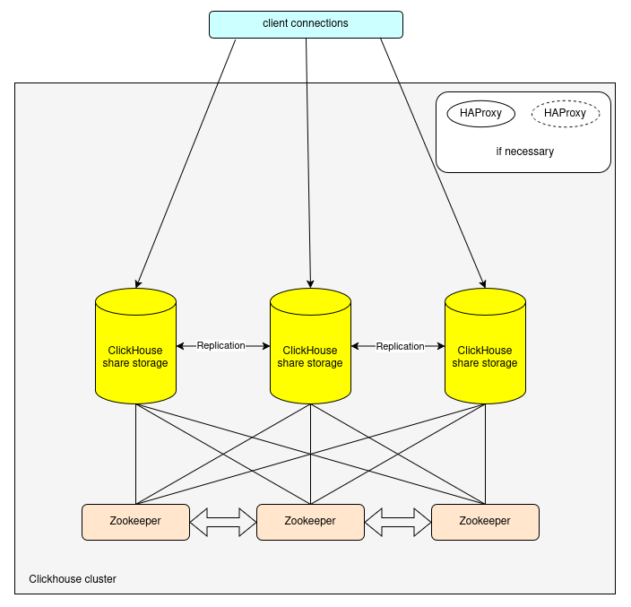

**Описание:** хранение аналитических данных (используется для хранения данных шар и выполнения агрегационных запросов к ним).  Данные на всех узлах идентичные – используем репликацию. Используем пакет github.com/ClickHouse/clickhouse-go/v2 – в этой версии можно включить клиентскую балансировку. Также для более гибкой балансировки можно использовать HAProxy.  

**Технологии:** Clickhouse, Zookeeper

**Функции:**   
  - хранение данных шар
  - агрегационные запросы

#### 2.5.6 Очереди

  - **Kafka кластер**

    **Описание:** брокер очередей для обработки больших потоков данных. Обеспечивает асинхронную обработку задач. Кластер из трех нод под управлением Zookeeper.  
    **Технологии:** Apache Kafka, Zookeeper, UI for Kafka.  
    **Функции:**  
    - прием потока шар от майнинг серверов и передача их в сервис обработки и хранения шар
    - сбор логов и метрик со всей системы и доставки их потребителям
    - другой обмен данными с микросервисами по модели издатель-подписчик. 

  - **RabbitMQ кластер**

    **Описание:** гарантированная доставка критических данных (данные найденного блока, данные по начислениям вознаграждений) в условиях невысокой планируемой нагрузки (в отличии от Kafka с его потоками данных). Кластер из трех нод.  
    **Технологии:** RabbitMQ.  
    **Функции:**
    - доставка данных по найденному блоку
    - доставка данных по подтвержденному блоку
    - доставка данных по вознаграждениям

#### 2.5.7 Observability

#### **Сбор и обработка логов**  

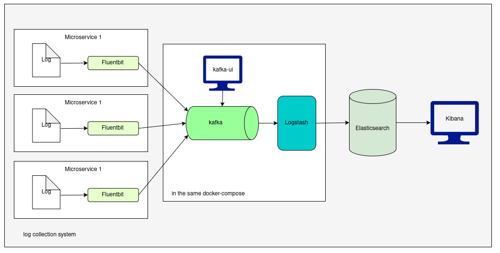

- **Описание:** Микросервис генерирует логи, которые записывает в файл или несколько файлов. Fluentbit (легковесный сборщик логов) – собирает, обрабатывает и передает логи в Kafka. Потом Logstash дополнительно преобразует и обозащает логи и передает их на хранение в Elasticsearch. Далее с помощью Kibana (инструмент для визуализации данных и анализа информации, которая хранится в Elasticsearch) можно анализировать и визуализировать данные логов.

- **Технологии:** EFK стек.  Elasticsearch,  Fluentbit,  Kibana,  Kafka, Logstash.
- **Функции:**  
  - сбор логов и отправка в очередь Kafka
  - обогащение в Logstash
  - хранение в  Elasticsearch
  - визуализация и анализ в Kibana

#### **Сбор и обработка метрик**

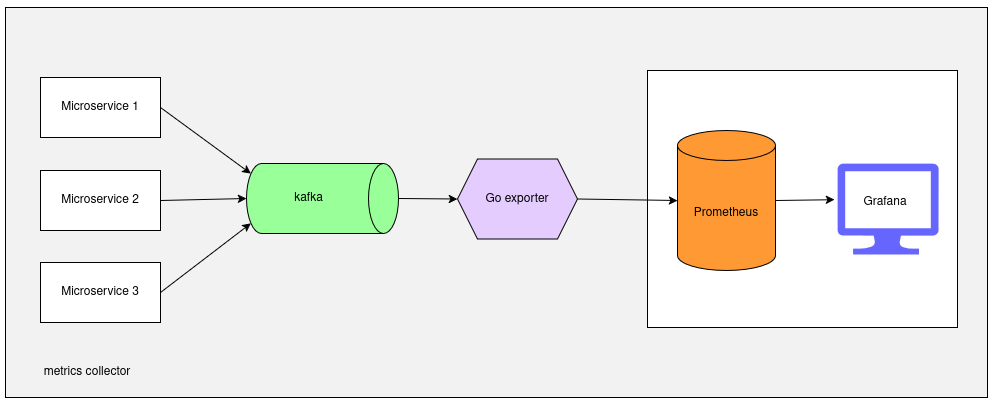

- **Описание:** Все микросервисы генерируют набор метрик, которые пишутся в Kafka, а потом с помощью Go exporter забираются из Kafka, преобразуются в нужный формат. Потом Prometheus (открытая система мониторинга и алертинга, созданная для сбора, хранения и визуализации метрик в реальном времени) забирает метрики из Go exporter и сохраняет в свойе базе в виде временных рядов. Конечный пользователь (администратор) с помощью Grafana (мощная платформа для визуализации данных и построения интерактивных дашбордов, используется для анализа и мониторинга метрик) выполняет сложные запросы к метрикам, агрегирует данные, вычисляет тренды и анализирует аномалии.
- **Технологии:** Kafka, Prometheus, Grafana
- **Функции:**   
  - сбор метрик
  - экспорт метрик в Prometheus
  - просмотр и анализ метрик в Grafana

#### **Сбор и обработка трейсов**

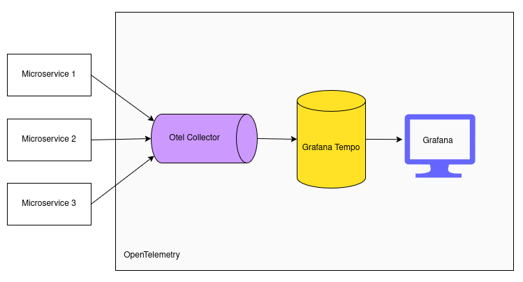
      
- **Описание:** Трассировка микросервисов (distributed tracing) — это метод отслеживания пути запроса через все компоненты распределенной системы, чтобы понять, как он обрабатывается, где возникают задержки или ошибки. В микросервисной архитектуре, где один запрос может проходить через десятки сервисов, трассировка становится критически важной для диагностики проблем и анализа производительности.

  Трассировка позволяет: 
  - Визуализировать путь запроса через все сервисы.
  - Измерять latency на каждом этапе.
  - Выявлять узкие места (например, медленный микросервис).
  - Анализировать взаимодействие между компонентами.  

  Микросервисы отправляют трейсы в OpenTelemetry Collector (Otel Collector) - инструмент, разработанный в рамках проекта OpenTelemetry, который предназначен для сбора, обработки и экспорта телеметрических данных (трейсов, метрик и логов) из распределенных систем.

  Otel Collector  отправляет данные в Grafana Tempo - распределенную система хранения трейсов (данных трассировки). Предназначена для работы в составе экосистемы Grafana и интегрируется с OpenTelemetry, Prometheus, Loki и другими инструментами. Tempo фокусируется на эффективном хранении и запросе трейсов в больших распределенных системах, таких как микросервисы или контейнеризированные приложения.

  Данные из Grafana Tempo визуализируются и анализируются с помощью Grafana.

- **Технологии:** OTel Collector, Grafana Tempo, Grafana
- **Функции:**   
  - сбор трейсов  Otel Collector
  - экспорт в хранилище  Grafana Tempo
  - визуализация и анализ в Grafana

#### 2.5.8 Config management system

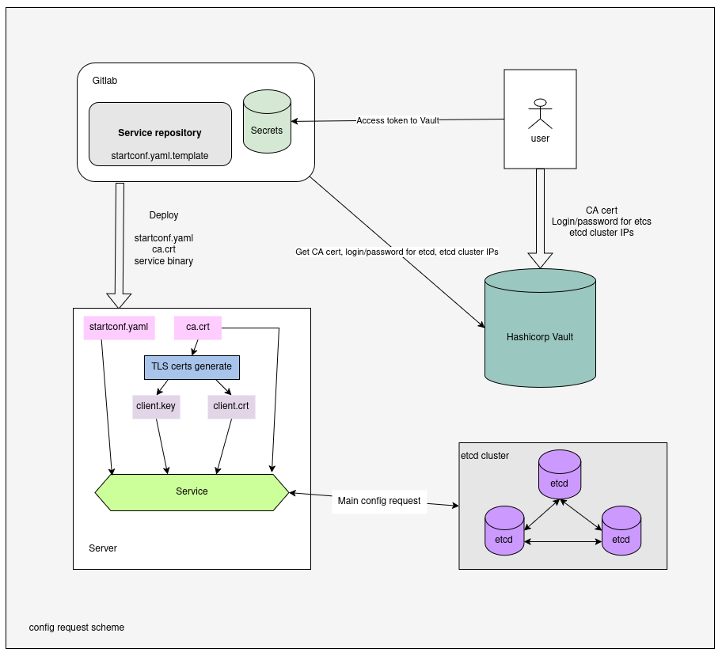

По причине наличия в перспективе нескольких десятков распределенных микросервисов встает проблема управления их конфигурациями. Заходить на каждый сервер и вручную вносить правки не представляется сколько-нибудь эффективным, поэтому необходимо централизованно хранить все конфигурации в отказоустойчивой, защищенной базе данных. А также нужен механизм для внесения правок и загрузки этих конфигураций на сервера.

Для этих целей используются следующие инструменты:
- Hashicorp Vault
- Gitlab Secrets
- etcd кластер
- генератор TLS сертификатов

Администратор хранит критические данные в хранилище Hashicorp Vault (инструмент для безопасного управления секретами: пароли, API-ключи, сертификаты, токены и т.д.).

В Gitlab Secrets хранится токен доступа к Vault. В процессе развертывания приложения через Gitlab CI получаем секреты из Vault, генерируем стартовый конфиг startconf.yaml (куда пишем этот токен) и деплоим его и корневой сертификат на целевой сервер.

На сервере с помощью корневого сертификата генерируем TLS сертификаты для работы приложения.

При запуске приложения, используя токен Vault, получаем доступ к кластеру с конфигурациями и загружаем на сервер конфигурационный файл нужного микросервиса. Стартуем микросервис.

В перспективе можно реализовать отслеживание изменений конфигурации в реальном времени и перезапуск приложения при изменении конфига.

### 3. Требования к функционалу

#### 3.1. Требования к пользовательской части (пользовательский фронтенд)
Пользовательская часть представляет собой  SPA (single page application) приложение, выполняющееся в браузере.

Должна иметь следующий функционал, страницы и элементы интерфейса:  
- **На главной странице** долже быть список всех поддерживаемых криптовалют, с указанием алгоритма хеширования и текущими параметрами работы (общий хешрейт, количество майнеров/воркеров онлайн, время последжнего блока)
- **Поиск по кошельку**, ведущий на страницу майнера
- **Страница с параметрами подключения к пулу.** На которой можно выбрать интересующую криптовалюты, указать защищенное соединение или нет (SSL), метод вознаграждения, сервер (с наиболее коротким пингом), указать какую программу майнер будет использовать пользователь, указать свой кошелек. Как итог нужно предоставить пользователю конфигурационный файл для запуска программы майнера, которая подключится к пулу и начнет добычу. Конфиг можно будет скопировать как текст или же загрузить уже как готовый файл.
- **Поддержка нескольких языков.** В шапке должен быть переключатель языков.
- **Ссылки на группы** поддержки в Telegram и Discord.
- **Страница криптовалюты:**  
  - должны отображаться текущие параметры работы пула в разрезе методов вознаграждения: комиссия пула, минимальный размер выплаты, периодичность выплат, количество майнеров/воркеров онлайн, текущий хешрейт, общее количество  добытых блоков, дата нахождения последнего блока.
  - должно отображаться текущие усилие нахождения блока, среднее усилие за последние 100 блоков и среднее усилие за все время работы пула.
  - Калькулятор. При указании своего хешрейта и метода вознаграждения майнер должен увидеть ориентировочный доход на пуле за вычетом комиссии пула на который он может рассчитывать по истечении дня/недели/месяца добычи. А также может получить рекомендации по выбору метода получения вознаграждения.
  - Текущий курс криптовалюты в долларах и ссылки на бирже, где можно эту криптовалюту обменять.
  - Список программ-майнеров, с помощью которых можно добывать криптовалюту, их процент и ссылки на скачивание.
  - Список доступных серверов для добычи с возможностью выбора локации и метода вознаграждения и генерацией ссылки для подключений (адрес сервера и порт).
  - Графики хешрейтов: общий – сумма хешрейтов по всем используемым методам возгнаграждения и в разрезе каждого метода.
  - Статистика добычи блоков  в разрезе методов вознаграждения (дата, высота блока, хеш, общее затраченное усилие, награда за блок, кто добыл и на каком сервере).
  - Список активных майнеров в разрезе методов вызнаграждения (кошелек, хешрейт, дата последней шары)
  - Список выплат  в разрезе методов вызнаграждения (дате, сумма, кошелек, ID транзакции со ссылкой на blockchain explorer криптовалюты).
  
- **Страница майнера:**  
  - несколько вкладок для каждого метода вознаграждения
  - для каждого метода отображается: текущий хешрейт, средний хешрейт, количество воркеров онлайн/офлайн, доля хешрейта майнера в общем хешрейте пула, невыплаченный баланс, выплаченная сумма, минимальный установленный размер выплаты с возможностью ее смены.
  - график хешрейта и среднего хешрейта майнера по каждому методу
  - таблица воркеров онлайн (название, текущий хешрейт, средний хешрейт, дата последней шары)
  - таблица воркеров офлайн
  - таблица выплат майнера (дата, ID транзакции со ссылкой на blockchain explorer, сумма выплаты).
  - таблица начисленных вознаграждений майнера (дата, высота блока, сложность блока, сложность шары нашедшей блок, хеш блока со ссылкой на blockchain explorer, сумма вознаграждения майнера). При нажати на сумму – развертывается детальная информация по наградам по каждому воркеру майнера.
- **Страница воркера:** тоже что и у майнера, только в разрезе воркера.
- **Страница найденных блоков**  
  - таблица действительных блоков – подтвержденные блоки, за который была получена награда (дата блока, хеш блока со ссылкой на blockchain explorer).
  - Таблица ожидающих блоков – найденные, но еще неподтвержденные блоки.
  - Плохие блоки – наденные, но отклоненные блоки, за которые награда не начислялась.

-  **Страница реферальной программы:** описание реферальной программы и ссылки на вход или регистрацию  
  - **Страница пользователя  реферальной программы**
    - реферальная ссылка, для привлечения других пользователей
    - балансы заработанного по каждой криптовалюте
    - форма указания порога выплаты и кошелька для выплат
    - список рефералов пользователя
          
  - **В футере** ссылки на Telegram bot системы, чаты поддержки в Telegram и Discord.

#### 3.2. Требования к администраторской части (администраторский фронтенд)
Администраторская часть представляет собой  SPA (single page application) приложение, выполняющееся в браузере.

Должна иметь следующий функционал, страницы и элементы интерфейса:  
- **Защищенность**  
Доступ к странице администратора закрыт паролем, взаимодействие происходит по защищенному TLS соединению.

- **Страница “Мониторинг”**  
  - для каждой криптовалюты свой вкладка
  - каждый сервер в разрезе регион/криптовалюта/метод вознаграждения имеет окошко, где в режиме реального времени выводится список количества последний присланных от майнеров шар. Это позволяет нагляно наблюдать за текущей активностью на всех серверах системы, оценивать их загруженность и обнаруживать их падение.
  - окно подключений/отключений воркеров. В режиме реального времени выводится список подключающихся/отключающихся воркеров, что позволяет отслеживать аномальную активность или проблемы с подключениями. В строке отображается имя воркера, сервер на котором он работает, ссылки на воркер и кошелек на основном сайте для просмотра графиков и статистики работы.
  - Окно найденных блоков: отображение в реальном времени найденных и подтвержденных блоков.
  - Окно с ошибками пула: отображение в реальном времени ошибок, возникающих в процессе функционирования пула.
  - Окно выплат: отображение в реальном времени платежей, сделанных системой на кошельки майнеров.

- **Страница “Выплаты”**  
  - возможность вручную делать платежи на указанный кошелек по каждой криптовалюте

- **Страница “Деньги”.** Информация по кошелькам пула. По каждой криптовалюте отображается:
  - Суммарный баланс по криптовалюте на кошельках пула
  - Балансы по каждому кошельку
  - Невыплаченный баланс
  - Чистый остаток
  - Невыплаченные суммы пользователей в разрезе кошельков/методов вознаграждения
 
 
- **Страница “Серверы”** – мониторинг загруженности и состояния всех серверов системы  
  - RAM всего  
  - RAM использовано
  - Swap всего
  - Swap использовано
  - Диск всего
  - Диск использовано
  - Диск доступно
  - Диск использовано в процентах
  - Загрузка CPU
  - Трафик по часам, трафик по дням, трафик по месяцам

- **Страница “Статистика”** – статистика работы воркеров  
  - поиск воркера по названию
  - отображение IP, текущего хешрейта, среднего хешрейта, дата последней шары, время создания воркера, ссылка на страницу майнера
  - построение графика количества присланных шар. Полезно для выявления аномалий в работе воркеров.

- **Страница “Конфиги”** – управление ручной подстройкой работы воркеров по методу FPPS (оплаты за каждую присланную шару).  
- **Страница “SEO”** – управление описаниями на страницах криптовалют.  
- **Страница “Рефералы”**
  - просмотр списка рефералов по каждой криптовалюте
  - просмотр начислений и списаний по реферальной программе

- **Страница “Воркеры”**  
Для только что зарегистрированных воркеров существует “льготный период”, когда с них не взимается комиссия пула. На этой странице отображается список таких воркеров с начало и концом их “льготного периода”.

- **Страница “Утилиты”**
  - Валидация кошельков: проверка на корректное название кошелька для каждой криптовалюты.
  - Пересчет графиков хешрейта и среднего хешрейта по каждой криптовалюте: при нажатии соответствующей кнопки запускается процесс пересчета данных для построения графиков. Бывает необходимо после возникновения сбоев.

- **Страница “Блоки”**  
  - список всех найденных блоков (хеш, сервер, криптовалюта, статус, высота, награда, дата)
  - просмотр долей майнеров, добывших этот блок – открывается при нажатии на кнопку “доли майнеров”. Отображается имя воркера, процент вклада в работу, награда.

#### 3.3. Поддерживаемые криптовалюты
- **Alephium (ALPH)**  
Алгоритм Blake 3. Для работы ноды требуется диск > 100Gb, RAM >= 4Gb.

- **Kaspa (KAS)**  
Алгоритм HeavyHash. Для работы ноды требуется диск > 100Gb, RAM >= 4Gb.

- **Nexa (NEXA)**  
Алгоритм NexaPow. Для работы ноды требуется диск > 30Gb, RAM >= 2Gb.

- **Dynex (DNX)**
Алгоритм DynexSolve. Для работы ноды требуется диск > 40Gb, RAM >= 4Gb.

- **Hypra (HYP)**
Алгоритм EthashB3. Для работы ноды требуется диск > 30Gb, RAM >= 2Gb.

#### 3.4. Алгоритмы вычисления вознаграждений
Перед началом майнинга пользователь может выбрать алгоритм начисления вознаграждений.

#### 3.4.1. **PROP**  
**Алгоритм PROP** (Proportional Reward) — награда за найденный блок делится между участниками пропорционально их вкладу в вычислительный процесс.

**Как работает PROP?**  
1. **Сбор шар (shares)**
  - Майнеры отправляют в пул «шары» — попытки решить криптографическую задачу.
  - Каждая шара — это доказательство работы майнера, даже если она не привела к нахождению блока.
2. **Начисление вознаграждения**
  - Когда пул находит блок, его награда (например, 6.25 BTC + комиссии) распределяется между майнерами пропорционально суммарной сложности шар, которые они отправили до нахождения блока.

  - Формула:  Вознаграждение майнера = (суммарная сложность шар майнера / общая сложность всех шар в блоке) × Награда за блок
       
  - После нахождения блока счётчик шар обнуляется, и начинается новый раунд.

3. **Особенности PROP**  
  - **Прозрачность:** Вознаграждение зависит только от вклада майнера.
  - **Риск «нерегулярных» выплат:** Если пул долго не находит блок, майнеры не получают вознаграждение до его нахождения.
  - **Учет только «валидных» шар:** Пул игнорирует шары с ошибками или слишком низкой сложностью.

**Плюсы**
  - Справедливое распределение.
  - Низкая комиссия пула.
  - Подходит для майнеров с стабильным хешрейтом.

**Минусы**  
  - Непредсказуемость доходов (зависит от удачи пула).
  - Возможны задержки в выплатах.
  - Не защищает от «атак сброса» (pool hopper), когда майнер присоединяется только при близком нахождении блока. Цель пул-прыгуна - найти пул, который близок к нахождению блока, и присоединиться к нему в последний момент, чтобы получить долю награды, не участвуя в длительном процессе майнинга.

#### 3.4.2. **SOLO**  
   Гибридный подход, при котором майнер подключается к пулу, но работает независимо, как в классическом SOLO. В этом случае пул выступает лишь посредником для подключения к блокчейну, а майнер сохраняет шанс получить полную награду за блок (без дележа с другими участниками).

**Плюсы SOLO на пуле**  
  - **Удобство:** Пул предоставляет стабильное подключение к сети, инструменты для мониторинга и автоматическую настройку сложности.
  - **Нет конкуренции:** Другие участники пула не влияют на ваши шансы (в отличие от обычных пулов с PROP/PPLNS).
  - **Комиссии ниже, чем в обычных пулах:** Обычно комиссия составляет 0.5-2% от награды за блок (вместо 1-3% в стандартных пулах).

**Минусы**  
  - Те же риски, что в классическом SOLO: 
    - При низком хешрейте шансы найти блок минимальны.
    - Возможны длительные периоды без дохода.
  - **Зависимость от пула:**  
 Если пул временно отключится, вы не сможете майнить.

#### 3.4.3. **FPPS**  
**FPPS (Full Pay Per Share)** — это метод начисления вознаграждений в майнинг-пулах, при котором майнеры получают оплату за каждую валидную шару (share), а также долю от комиссий за транзакции в блоке. Этот метод гарантирует стабильные выплаты, даже если пул не находит блок, но обычно имеет более высокие комиссии для покрытия рисков пула.

**Как работает FPPS?**  
**Шары (Shares)**  
 Майнеры отправляют в пул «шары» — решения криптографических задач, которые не обязательно приводят к нахождению блока. Каждая шара проверяется пулом на соответствие сложности.

**Начисление вознаграждения**  
- На нахождение блока затрачивается определенный объем работы, который зависит от сложности сети.
- Пул регулярно вычисляет стоимость единицы работы (сложности) по нахождению блока. Зависит от сложности сети и текущей награды за блок.
- Пул выплачивает некоторую сумму за каждую валидную шару, независимо от того, был ли найден блок. Стоимость шары = цена единицы работы * сложность шары в этих единицах.
- Комиссии распределяются пропорционально вкладу майнера в пул.

**Плюсы:**  
- Стабильный доход даже при неудачах пула.
- Учитывает комиссии, повышая общую прибыль.
- Подходит для майнеров с постоянным хешрейтом.

**Минусы:**  
- Высокие комиссии пула (до 3%).
- Зависимость от сложности сети.
- Пул может нести существенные убытки при длительной неудаче.

#### 3.4.4. **PPLNS**  
**PPLNS (Pay Per Last N Shares)** — это метод начисления вознаграждений в майнинг-пулах, где награда за найденный блок распределяется между майнерами пропорционально их вкладу в последние N шар (shares), отправленных в пул до нахождения блока. Этот метод защищает пул от «атак сброса» (когда майнеры подключаются только при близком нахождении блока) и обеспечивает более справедливое распределение доходов.  

**Как работает PPLNS?**  

1. **Пул находит новый блок** – это запускает расчет награды для майнеров. 
2. **Определяется N** – количество последних валидных решений (шар), участвующих в распределении награды. 
3. **Рассчитывается вклад каждого майнера** – учитываются только его шары, попавшие в окно последних N решений. 
4. **Начисляется награда** – каждый майнер получает часть награды пропорционально количеству его решений в этом окне.

**Преимущества PPLNS:**  
- Защита от пул-хоппинга (Pool Hopping) – майнеры не могут просто подключаться перед нахождением блока и быстро уходить, как в PPS. Выплаты учитывают только постоянных участников.
- Меньшая комиссия пула – в отличие от PPS, где пул берет на себя риск нестабильных доходов, в PPLNS выплаты происходят только после нахождения блока, что снижает затраты пула.
- Стимулирует долгосрочный майнинг – чем дольше майнер работает в пуле, тем больше у него решений в окне N и выше шансы на хорошую награду.
Недостатки PPLNS:
- Нет гарантированной выплаты за каждый шар – если пул долго не находит блок, майнеры могут не получать награды.
- Волатильность дохода – при удачном стрике блоков выплаты выше, при неудачном – значительно ниже.
- Сложность прогнозирования доходов – из-за случайного характера нахождения блоков майнеры не могут точно предсказать свои ежедневные выплаты.

На первый взгляд может показаться, что PPLNS выгоден для тех, кто подключился незадолго до нахождения блока. Однако на практике это не так из-за механизма "скользящего окна" (Sliding Window).

**Почему "пул-хоппинг" не работает в PPLNS?** 
1. Окно N покрывает последние шары перед нахождением блока, но его размер обычно зависит от сложности сети и может быть довольно большим (например, 10-20 раз больше, чем необходимое количество решений для нахождения одного блока).
2. Если майнер только что подключился, у него мало решений в этом окне, и он получит меньшую долю награды по сравнению с теми, кто работал долго.
3. Напротив, те, кто майнит стабильно, имеют больше решений в последнем N-окне и получают более справедливую долю.

#### 3.5. Требования к производительности
- **Скорость работы:** Время отклика и обработки запроса при подключении воркера к ближайшему географическому серверу не должно превышать 100 миллисекунд. На начальном этапе система должна выдерживать 10000 одновременных подключений воркеров.
- **Нагрузочное тестирование:** Система должна выдерживать до 100000 одновременных подключений, что соответствует вставке 10000 записей в секунду.
- **Масштабируемость:** Должен быть обеспечен простой механизм добавления новых серверов для горихонтального масштабирования нагрузки.

#### 3.6. Требования к безопасности
- **Уровни доступа:**  
- Пользователь – подключает воркеры к пулу, просматривает статистику их работы, получает выплаты.
- Авторизованный пользователь – может участвовать в реферальной программе.
- Администратор – имеет запароленный доступ в администраторский раздел. Просматривает всю статистику и метрики работы системы. Изменяет параметры работы серверов. Регулирует параметры работы алгоритмов.
- Главный администратор – полный контроль над всем программным обеспечением и оборудованием.

- **Шифрование данных:** Используются SSL/TLS сертификаты для обеспечения защищенных каналов обмена данными между микросервисами и доступа к фронтенд части.
      
- **Мониторинг:**   
  - **Логи** - фиксируют все аспекты функционирования микросервисов. Доступ к логам имеет только главный администратор.
  - **Метрики** – измеряют состояние системы, приложения или бизнес-процесса в определённый момент времени. Они используются для мониторинга, анализа, оптимизации и принятия решений. Используются для обнаружения аномалий и проблем. 

#### 3.7. Технические требования

- **Языки программирования:** 
  - **Golang** – на нем написаны все микросервисы
  - **Node.js** – используется как вспомогательный инструмент при реализации алгоритмов работы с некоторыми криптовалютами. А также как инструмент сборки Vue.js SPA приложения фронтенда.
  - **Javascript (Vue.js)** – создание SPA приложений фронтенда (пользовательская часть и админка).

- **Технологии:**
  - **Docker** – развертывание инфраструктуры и приложений.
  - **YAML** – файлы конфигурации микросервисов, инфраструктуры и docker-compose.
  - **Ansible** – развертывание инфраструктуры.
  - **CGO механизм в Golang** - позволяет интегрировать код на языке C в Go-программы. Необходим для подключения C-библиотек при реализации алгоритмов работы с некоторыми криптовалютами.
  - **TLS** – сертификаты для зашифрованных соединений
  - **JWT** (JSON Web Token) - для безопасной передачи информации между сервисами или микросервисами, обеспечивая целостность и подлинность данных.
  - **REST** (Representational State Transfer) API – для общения фронтенда с бекендом.
  - **Redis** – кеширование
  - **Websocket** – передача данных на фронт в реальном времени
  - **JSON** - (JavaScript Object Notation) -  текстовый формат обмена данными, основанный на синтаксисе объектов JavaScript. Для обмена данными между микросервисами и фронтендом.
  - **gRPC** (Google Remote Procedure Call) - высокопроизводительный фреймворк для удаленного вызова процедур. Для обмена данными между микросервисами.
  - **Protocol Buffers (Protobuf)** - формат сериализации данных, используемый в gRPC.
  - **Gitlab CI/CD** — инструмент для автоматизации процессов непрерывной интеграции (CI) и непрерывной доставки/развертывания (CD) , встроенный в платформу GitLab. Позволяет автоматизировать сборку, тестирование, упаковку и деплой приложений при каждом изменении кода в репозитории.
  - **Apache ZooKeeper** — это распределённая координационная служба, разработанная для управления и синхронизации конфигураций, состояний и метаданных в распределённых системах. Используется с Kafka, Clickhouse.
  - **VDS** – виртуальный выделенный сервер. На этих серверах работает инфраструктура и микросервисы.
  - **Ubuntu** – операционная система, под управлением которой работают все компоненты системы.
  - **HAProxy** – балансировщик
  - **pgBouncer** - легковесный менеджер подключений для PostgreSQL , который оптимизирует работу с базой данных, уменьшая нагрузку на сервер за счет повторного использования соединений.
  - **Patroni** - инструмент с открытым исходным кодом для управления кластерами PostgreSQL в режиме высокой доступности.
  - **Nginx – веб-сервер**
  - **Stratum** – протокол обмена данными между пулом и воркерами майнеров.
  - **Blockchain API** – для обмена данными между блокчейн нодой  и пулом.
  - **Telegram Bot API** – для написания Telegram ботов.
  - **Git** - система контроля версий. Для управления разработкой программного обеспечения. Позволяет сохранять историю изменений, работать в команде, ветвить код и объединять изменения без конфликтов.
  - **GitLab** - платформа для управления полным жизненным циклом разработки программного обеспечения. Для хранения исходного кода и развертывания.

- **Очереди**  
  - **Apache Kafka** – распределенная потоковая платформа (streaming platform), разработанная для обработки, хранения и передачи больших объемов данных в реальном времени. Для обработки потока шар от майнеров, потока логов, метрик и трейсов.
  - **UI for Kafka** - графический инструмент, который упрощает управление кластерами Kafka, мониторинг топиков, работу с сообщениями и настройку конфигураций.
  - **RabbitMQ** – распределенный брокер сообщений. Для гарантированной доставки критических данных. 
      

- **Базы данных в кластерах:**   
  - **PostgreSQL** – реляционная база данных
  - **Clickhouse** - высокопроизводительная колоночная СУБД для быстрого выполнения аналитических запросов на больших объёмах данных.
  - **etcd** - распределённое отказоустойчивое хранилище данных типа «ключ-значение», созданное для быстрого и согласованного доступа к данным в кластере серверов.
  - **etcd-keeper** – UA интерфейс для работы с записями в базе данных etcd.
          

- **Observability:**  
  - **Elasticsearch** - распределённая поисковая и аналитическая система для быстрого полнотекстового поиска, анализа данных в реальном времени и обработки больших объёмов информации. Для обработки логов.
  - **Fluentbit** – агент по сбору логов.
  - **Kibana** – визуализация и анализ логов.
  - **Prometheus** – база данных временных рядов. Для хранения, обработки и анализа метрик.
  - **OpenTelemetry** - набор инструментов для наблюдения за распределёнными системами.
  - **Otel Collector** -  сбор, обработка и экспорта телеметрических данных (трейсов, метрик) из распределенных систем. Для трейсов.
  - **Grafana Tempo** -  распределенная система хранения трейсов.
  - **Grafana** -  платформа для визуализации данных и построения интерактивных дашбордов, используется для анализа и мониторинга метрик из Prometheus и трейсов из Grafana Tempo.

## Приложения

### Приложение 1. Глоссарий терминов.

**Майнинг пул** – объединение вычислительных мощностей майнеров для решения криптографической задачи. После успешного решения (добычи блока) награда распределяется между майнерами пропорционально затраченным ими мощностям.

**Майнер (человек)** – человек, с помощью программы-майнера и специализированного оборудования, решающий криптографическую задачу.

**Майнер (программа)** – программа, запускающаяся на спецоборудовании (видеокарта, FPGA, ASIC) и с помощью определенного для каждой монеты алгоритма, решающая задачу.

**Майнер (идентификатор кошелька)** – это уникальный адрес (wallet address), используемый для получения наград за добытые криптовалюты. Этот адрес связывает вашу криптовалютную учётную запись с системой майнинга, чтобы перевести заработанные монеты на ваш кошелёк.

**Монета (криптовалюта, coin)** — это криптовалюта, которая создаётся (добывается) майнерами с использованием вычислительных мощностей. Майнеры решают сложные математические задачи, чтобы верифицировать транзакции в блокчейне и добавлять новые блоки. В награду за свои усилия они получают определённое количество монет этой криптовалюты.

**Блокчейн** — это децентрализованная, распределённая база данных или реестр, который хранит информацию в виде последовательности блоков, связанных между собой с помощью криптографических методов.

**Блок** – структура данных, которая содержит записи транзакций, которые подтверждены и защищены от изменений, что делает блокчейн прозрачным, надёжным и устойчивым к мошенничеству.

**Шара** - это частичное решение криптографической задачи, отправляемое майнером пулу для подтверждения своей работы. Шары используются для измерения вклада каждого майнера в общий процесс добычи блока.

**Награда за майнинг** - в большинстве блокчейнов майнеры получают монеты в качестве награды за добавление нового блока в сеть. Размер награды обычно фиксируется, но со временем может уменьшаться (например, в случае с биткоином каждые 4 года происходит "халвинг" — уменьшение награды вдвое). В случае майнинг пула награда распределяется между майнерами пропорционально затраченным ими мощностям.

**Proof of Work (PoW)** — это один из самых популярных и ранних механизмов консенсуса в блокчейн-сетях. Он используется для обеспечения безопасности, децентрализации и согласования данных между участниками сети. В основе PoW лежит выполнение вычислительных задач, которые требуют значительных ресурсов, что делает манипуляцию сетью крайне сложной и дорогостоящей.

**Алгоритмы Proof of Work:**  
Разные криптовалюты используют разные алгоритмы хеширования для реализации PoW:  
- **SHA-256:** Используется в биткоине.
- **Scrypt:** Легче для вычислений, используется в лайткоине и Dogecoin.
- **Ethash:** Ранее использовался в Ethereum (до перехода на Proof of Stake).
- **RandomX:** Оптимизирован для майнинга на процессорах, используется в Monero.

