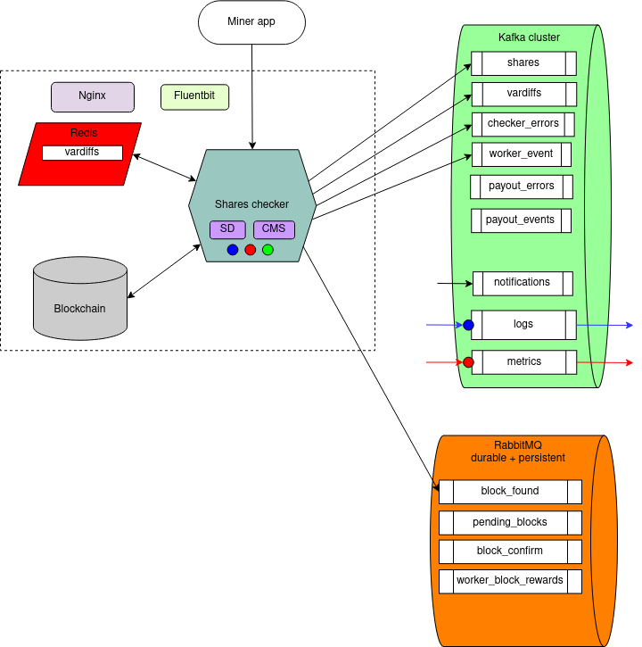
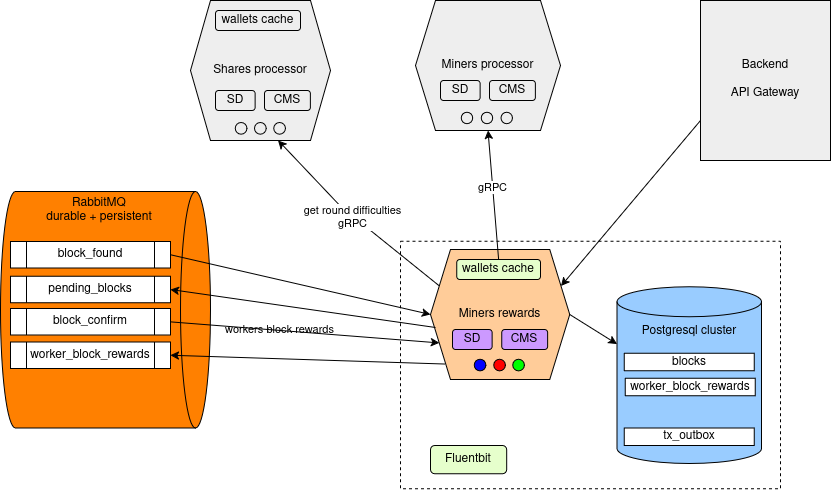
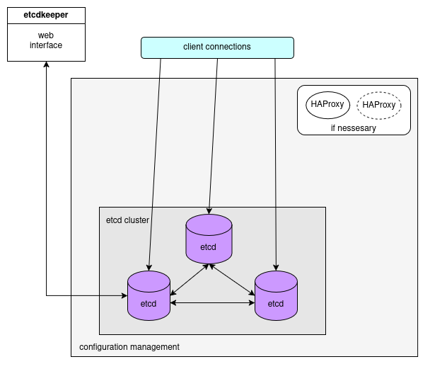
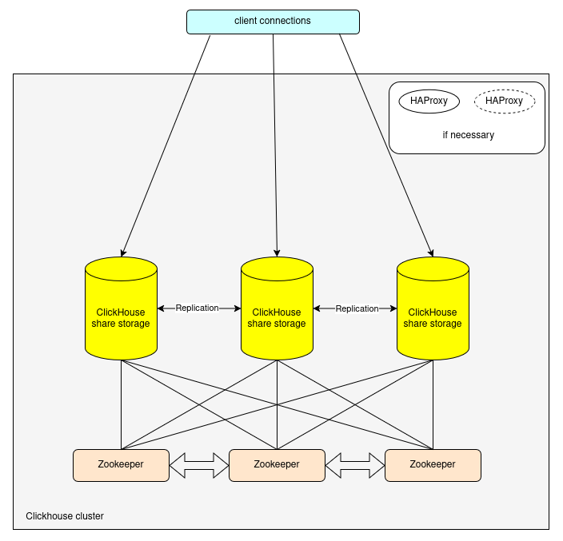
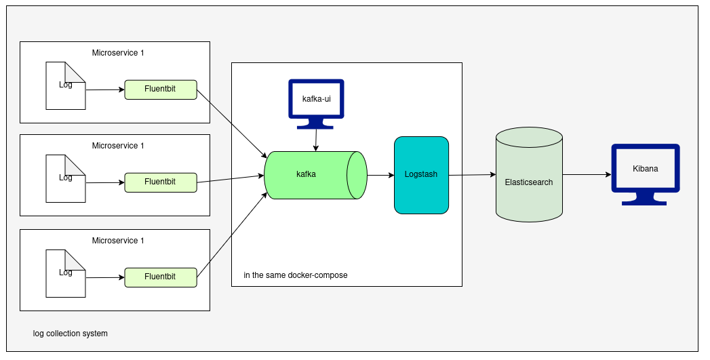
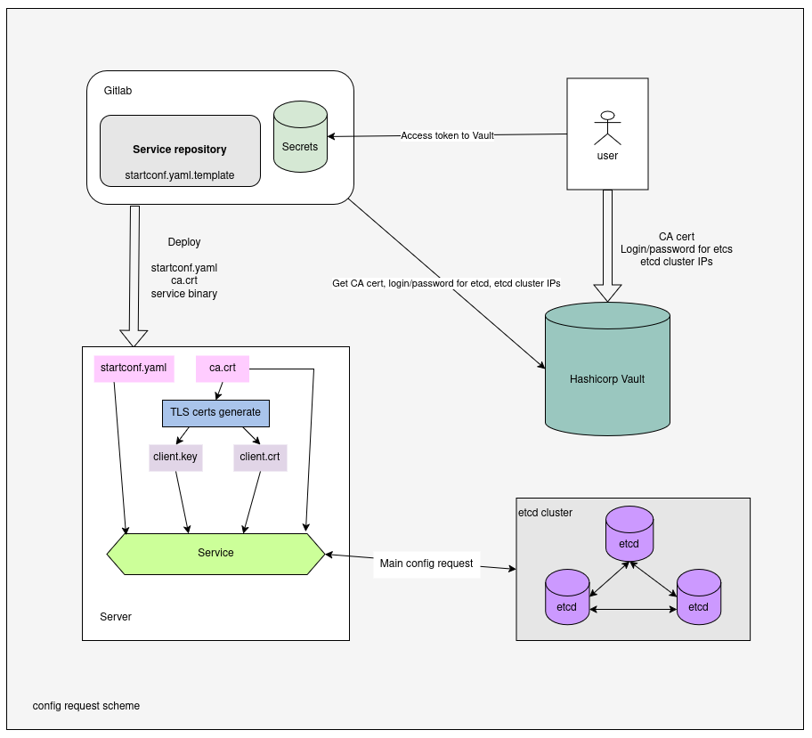

# Общая схема и технологии
## Общая упрощенная схема

**Miner** - оборудование и программа с помощью который пользователь осуществляет добычу криптовалюты.

**Telegram client** - интерфейс телеграм бота для взаимодействия пользователя с системой.

**Frontend** - пользовательский Web интерфейс (сайт в виде SPA приложения).

**Telegram miner bot** - микросервис реализующий Telegram бот для наблюдению за майнингом. 

**API Gateway** - микросервис для обработки HTTP/HTTPS запросов от клиентов (пользователи и администраторы) и распределения их между бэкенд микросервисами.

**Shares checker** - микросервис, разработанный под конкретную криптовалюту, получает задачу из блокчейн ноды, дробит ее на подзадачи и распределяет их между майнерами. Получает от майнеров решения, проверяет их и передает в микросервис обработки и хранения.

**Shares processor** - микросервис для получения потока решений от майнеров, сохранение их в базу, формирование агрегированных данных для пользователей и для формирования массива данных для расчета вознаграждений.

**Miners processor** - микросервис для работы с данными майнеров и воркеров. Заведение новых майнеров и воркеров в базе, выдача данных по ним по внешним запросам. Хранение текущих параметров работы майнеров/воркеров.

**Miners rewards** - микросервис для обработки найденных блоков, вычисления и хранения вознаграждений за блок.

**Miners payouts** - микросервис для осуществления выплат. Отдельная разработка для каждой криптовалюты.

**Notification manager** - микросервис для рассылки уведомлений.

**User manager** - микросервис для некоторых действий (реферальная программа, дополнительный функционал) где требуется регистрация и авторизация пользователей.

## Используемые технологии (перечисление)

**Языки программирования:** Golang, Node.js, Javascript (Vue.js).

**Технологии:** Docker, YAML, Ansible, CGO механизм в Golang, TLS, JWT, REST, Redis, Websocket, JSON, gRPC, Protocol Buffers (Protobuf), Gitlab CI/CD, Apache ZooKeeper, VDS, Ubuntu, HAProxy, pgBouncer, Patroni, Nginx, Stratum, Blockchain API, Telegram Bot API, Git, GitLab

**Очереди:** Apache Kafka, UI for Kafka, RabbitMQ

**Базы данных в кластерах:** PostgreSQL, Clickhouse, etcd, etcd-keeper

**Observability:** Elasticsearch, Fluentbit, Kibana, Prometheus, OpenTelemetry, Otel Collector, Grafana Tempo, Grafana

# Архитектура проекта (подробная)

## Схема

В высоком разрешении на [этой странице](https://laradrom.ru/struktura-i-komponenty-majning-pula/).

Пояснения к условным обозначениям:

- **Пунктирной рамкой** очерчены логические компоненты системы (микросервисы).
- **Шестиугольниками** разных цветов обозначены непосредственно бинарники микросервисов (Golang программы) – то, что собственно и реализует программист.
- **Стрелками** обозначены связи между компонентами: запросы, команды, потоки данных.
- **Значки внутри шестиугольников** обозначают внутренние подсистемы в программе, отвечающие за определенный функционал:
    - **SD** – Service Discovery. Все микросервисы пользуются механизмом обнаружения сервисов, то есть других микросервисов с которыми они взаимодействуют.
    - **CMS** – Config Management System. Все микросервисы загружают свою конфигурацию из отказоустоучивого кластера etcd.
    - **синий круг** – микросервис пишет логи в систему логирования
    - **красный круг** – микросервис пишет метрики в систему сбора метрик
    - **зеленый круг** – микросервис пишет трейсы систему в сбора, хранения и запроса трейсов
    - **wallets cache** – кеш данных майнеров и воркеров в оперативной памяти программы

- **Значок монитора** – означает пользовательский интерфейс.
- **Цилиндр** – база данных. Подразумевается отказоустойчивый кластер.
- **Подписанные прямоугольники в цилиндрах** – названия основных таблиц в базе.
- **Цилиндр на боку** (труба) – очередь сообщений.
- **Подписанные прямоугольники в цилиндрах на боку** – названия топиков или очередей.
- **Fluentbit** – агент сбора логов.

- **Frontend users** (Фронтенд пользователя).
  - **Описание:** SPA приложения на Vue.js. Веб-приложение в браузере. Асинхронная подгрузка данных через API Gateway через AJAX/Fetch API и WebSocket.   
    Страница в интернете, где майнеры просматривают текущее состояние пула, статистику работы своих воркеров, найденные блоки, распределение наград за найденный блок, параметры подключения и т.д.
  - **Технологии:** Vue.js (Javascript), HTML, CSS, REST, Websocket, Nodejs, Vite
  - **Функции:** Отображение пользовательского интерфейса, обработка действий пользователя, отправка запросов на сервер (API Gateway).

- **Frontend admin** (Фронтенд администратора)
  - **Описание:** SPA приложения на Vue.js. Веб-приложение в браузере. Асинхронная подгрузка данных через API Gateway через AJAX/Fetch API и WebSocket.   
    Защищенная паролем страница в интернете, где администратор может в режиме реального времени наблюдать за текущим состоянием майнинг серверов, просматривать балансы, изменять параметры и т.д.
  - **Технологии:** Vue.js (Javascript), HTML, CSS, REST, Websocket, Nodejs, Vite
  - **Функции:** Отображение администраторского интерфейса, отправка запросов на сервер (API Gateway), изменение параметров работы системы и т.д (более подробно в требованиях к админке).

- **Telegram user client**
  - **Описание:** подписка в Телеграме на Telegram miner bot
  - **Технологии:** Telegram
  - **Функции:** Отображение интерфейса отправки запросов в Telegram боту, отправка запросов в Telegram miner bot микросервис.

## Backend API Gateway

- **Функции:**
  - обработка HTTP запросов
  - обработка HTTPS запросов
  - обработка Websocket запросов
  - агрегация данных с нескольких микросервисов в один ответ
- **Технологии:** Golang, TLS, JWT, REST, Websocket

## Shares checker микросервис

- **Функции:**
  - TCP/HTTP сервер принимает входящие подключения воркеров майнера
  - Парсинг команд воркеров (реализация протокола Stratum)
  - Периодическое получение заданий из blockchain ноды через ее Blockchain API
  - Формирование задач майнерам (протокол Stratum)
  - Рассылка задач майнерам
  - Прием и проверка решений майнеров
  - Отправка решений (шар) в топик Kafka
  - Отправка решения блока в очередь RabbitMQ
  - Отправка решения блока в blockchain ноду (Blockchain API)
  - Отправка возникающих ошибок в соответствующий топик Kafka для последующей обработки
  - Отправка событий воркеров в соответствующий топик Kafka (подключение, отключение и т.п.)
  - Каждый микросервис имеет свой доменный адрес, для удобного подключения майнеров. Поэтому используется Nginx для связывает доменного имя с сервером.
  - Динамическая коррекция сложности каждого конкретного воркера для снижения нагрузки на сервер и равномерной выдачи заданий воркеру (vardif).
  - Хранение сложностей воркеров (vardiffs) в кэше Redis для быстрого их получения при подключении воркера и для избежания их потери в момент переподключения воркера.
- **Технологии:** Golang, Redis, Nginx, Fluentbit, Kafka, RabbitMQ, Stratum, Blockchain API

## Shares processor микросервис

- **Функции:**
  - чтение данных шар из топика Kafka
  - сохранение данных шар в Clickhouse
  - запрос данных майнеров/воркеров из микросервиса Miners processor (gRPC)
  - формирование массива данных по блоку по запросу из микросервиса Miners rewards
  - формирование агрегированных данных по запросам с фронтенда: текущие хешрейты воркеров, майнеров и пула в целом;
  - формирование агрегированных данных для построения графиков хешрейтов воркеров, майнеров и пула
  - поиск даты последней найденной шары для конкретного воркера
  - прочие аналитические запросы
- **Технологии:** Golang, Kafka, Clickhouse, gRPC, REST

## Miners processor микросервис

- **Функции:**
  - Прием наименований майнеров/воркеров из микросервиса Shares processor (gRPC)
  - Заведение нового майнера/воркера в базе, если его еще там нет (PostgreSQL)
  - Поиск идентификатора майнера/воркера в базе по запросам из внешних микросервисов (Shares processor, Miners rewards, Miners payouts, API Gateway)
  - Получение событий из Kafka, касающихся майнеров и воркеров и их обработка
- **Технологии:** Golang, PostgreSQL, Kafka, gRPC, REST

## Miners rewards микросервис

- **Функции:**
  - Получение данных по найденному блоку из очереди block_found RabbitMQ
  - Сохранение данных блока в базе PostgreSQL
  - Отправка ожидающего блока в очередь pending_blocks RabbitMQ (Transactional Outbox паттерн)
  - Получение данных подтвержденного блока из очереди block_confirm RabbitMQ
  - Запрос данных по усилиям каждого воркера при нахождении блока из микросервиса Shares processor (gRPC)
  - Вычисление награды каждого майнера/воркера за найденным блок
  - Сохранение данных о наградах в базу PostgreSQL
  - Отправка данных о наградах в очередь worker_block_rewards RabbitMQ
  - Запросы идентификаторов майнеров/воркеров из микросервиса Miners processor (gRPC)
  - Обработка запросов с фронтенда через API Gateway (REST). Данные по распределению наград за блок между майнерами, данные по наградам в разрезе майнера/воркера, данные по найденному блоку.
- **Технологии:** Golang, PostgreSQL, RabbitMQ, gRPC, REST

## Miners payouts микросервис

- **Функции:**
  - Получение из очереди pending_blocks RabbitMQ данных ожидающего подтверждения блока
  - Сохранение ожидающего блока в базе PostgreSQL
  - Периодическая проверка ожидающих блоков на предмет их подтвержденности в blockchain ноде (Blockchain API)
  - После подтверждения блока – отправка данных о подтверждении в очередь block_confirm  RabbitMQ
  - Получение данных о начисленных вознаграждениях из очереди worker_block_rewards
  - Добавление средств на баланс майнеров в базе PostgreSQL согласно полученным данным о вознаграждениях
  - Периодическая проверка балансов майнеров на предмет превышения порогового значения выплаты. При превышении порога – подготовка платежа на кошелек майнера
  - Платеж на кошелек майнера через Blockchain API.
  - Ожидание подтверждения платежной транзакции и отправка подтверждения в топик Kafka
  - Оправка событий по платежам и по ошибкам в соответствующие топики Kafka
  - Получение данных кошельков из микросервиса Miners processor
  - Обработка запросов с фронтенда через API Gateway
- **Технологии:** Golang, PostgreSQL, Kafka, RabbitMQ, gRPC, REST, Blockchain API

## Notification manager микросервис

- **Функции:**
  - Чтение событий из топиков Kafka
  - Сохранение событий в базу PostgreSQL
  - Рассылка сообщений о происходящих изменениях через Websocket API Gateway в броузер клиента (текущее усилие добычи, текущий хешрейт, платежи, нахождение блока и т.д.)
  - Рассылка сообщений о происходящих изменениях через Websocket API  Gateway в админку (текущие приходящие шары, статусы серверов, ошибки, алерты и другие характеристики)
  - Рассылка уведомлений и алертов в Telegram боты пользователя (нахождение блока, прерывание работы воркера) и администратора (падение сервера, критическая нагрузка и т.п.)
- **Технологии:** Golang, PostgreSQL, Kafka, gRPC, Websocket, Telegram Bot API

## User manager микросервис

- **Функции:**
  - регистрация пользователя
  - аутентификация.авторизация пользователя
  - выдача JWT токена
- **Технологии:** Golang, PostgreSQL, JWT

## Telegram miner bot микросервис

- **Функции:**
  - Отправка уведомлений от Notification manager нужному получателю в Telegram
  - Фиксация всех сообщений и событий в базе PostgreSQL
  - Получение данных необходимых для уведомлений из других микросервисов
  - Просмотр балансов кошельков
  - Просмотр статусов воркеров
  - Подсчет доходов
  - Уведомления об отключениях воркеров
  - Прочие оповещения
- **Технологии:** Golang, PostgreSQL, Telegram bot API

## PostgreSQL кластер
Хранение баз данных микросервисов. На общих схемах обозначен синим цилиндром с названиями таблиц. Ниже приведена более подробная схема.

- **HAProxy**  
  Балансировщик нагрузки. Сюда приходят запросы от клиентов. Ставится перед pgBouncer. Отслеживает “здоровье” нод с PostgreSQL и в случаем падения переключает поток запросов на “живую” ноду. Также разделяет потоки на чтение и на запись. Поток на чтение идет на мастер-ноду, на запись – на ноды реплики.

- **pgBouncer**  
  Менеджер подключений  (connection pooler) для PostgreSQL, который оптимизирует работу с базой данных, снижая нагрузку на сервер и ускоряя обработку запросов. Он выступает промежуточным звеном между приложением и PostgreSQL, управляя пулом соединений.  
  **Проблема:**  PostgreSQL создает отдельный процесс для каждого подключения, что потребляет память (до 10 МБ на соединение).  Ограничивает количество одновременных подключений (обычно до 100–1000).   
  **Решение:** pgBouncer повторно использует  соединения, уменьшая количество активных процессов PostgreSQL.  Например, 1000 клиентов могут работать через 10–20 реальных подключений к БД.

- **etcd нода**  
  Распределённое, отказоустойчивое, консистентное хранилище ключ-значение, для управления конфигурацией и координации работы сервисов. Работает в связке с Patroni. Хранит, обновляет и отслеживает изменения конфигурации кластера PostgreSQL в реальном времени.
- **Patroni**  
  Инструмент для управления высокодоступным кластером PostgreSQL. Автоматический failover при сбое мастера. Управление репликацией. Работает в связке с etcd.
  - PostgreSQL из коробки не умеет:
    - Автоматически переключаться на резервный узел при падении мастера.
    - Динамически управлять репликацией и конфигурацией кластера.

  - Patroni заполняет этот пробел, предоставляя:
    - Автоматический failover (переход на standby-сервер при сбое мастера).
    - Управление репликацией (создание/удаление реплик).
    - Динамическую конфигурацию (изменение параметров на лету).
    - Интеграцию с инструментами мониторинга и оркестрации (Kubernetes, Docker).

## etcd кластер

Распределенная key-value база данных. 

- **Технологии:** etcd

- **Функции:**
  - Хранение конфигураций микросервисов
  - Обнаружение сервисов (Service Discovery)
  - Patroni storage (для PostgreSQL кластера)

## Clickhouse кластер

**Технологии:** Clickhouse, Zookeeper

**Функции:**
- хранение данных шар
- агрегационные запросы

## Kafka кластер

  **Технологии:** Apache Kafka, Zookeeper, UI for Kafka.  
  **Функции:**
  - прием потока шар от майнинг серверов и передача их в сервис обработки и хранения шар
  - сбор логов и метрик со всей системы и доставки их потребителям
  - другой обмен данными с микросервисами по модели издатель-подписчик.

## RabbitMQ кластер

  **Технологии:** RabbitMQ.  
  **Функции:**
  - доставка данных по найденному блоку
  - доставка данных по подтвержденному блоку
  - доставка данных по вознаграждениям

## Сбор и обработка логов

- **Технологии:** EFK стек.  Elasticsearch,  Fluentbit,  Kibana,  Kafka, Logstash.
- **Функции:**
  - сбор логов и отправка в очередь Kafka
  - обогащение в Logstash
  - хранение в  Elasticsearch
  - визуализация и анализ в Kibana

## Сбор и обработка метрик

- **Технологии:** Kafka, Prometheus, Grafana
- **Функции:**
  - сбор метрик
  - экспорт метрик в Prometheus
  - просмотр и анализ метрик в Grafana

## Сбор и обработка трейсов

- **Технологии:** OTel Collector, Grafana Tempo, Grafana
- **Функции:**
  - сбор трейсов  Otel Collector
  - экспорт в хранилище  Grafana Tempo
  - визуализация и анализ в Grafana

## Config management system

По причине наличия в перспективе нескольких десятков распределенных микросервисов встает проблема управления их конфигурациями. Заходить на каждый сервер и вручную вносить правки не представляется сколько-нибудь эффективным, поэтому необходимо централизованно хранить все конфигурации в отказоустойчивой, защищенной базе данных. А также нужен механизм для внесения правок и загрузки этих конфигураций на сервера.

Для этих целей используются следующие инструменты:
- Hashicorp Vault
- Gitlab Secrets
- etcd кластер
- генератор TLS сертификатов

## Технологии (подробно)

- **Golang** – язык программирования. На нем написаны все микросервисы
- **Node.js** – это среда выполнения JavaScript , которая позволяет запускать код на сервере, а не только в браузере. Она построена на основе движка V8  (тот же, что используется в Google Chrome) и оптимизирована для быстрой обработки асинхронных операций (например, работа с сетью, базами данных, файлами).  
Используется как вспомогательный инструмент при реализации алгоритмов работы с некоторыми криптовалютами. А также как инструмент сборки Vue.js SPA приложения фронтенда.
- **Javascript (Vue.js)** – высокоуровневый, интерпретируемый язык программирования, который широко используется для создания интерактивных веб-страниц и веб-приложений. Он является одной из ключевых технологий веб-разработки наряду с HTML и CSS.   
 Cоздание SPA приложений фронтенда (пользовательская часть и админка).

- **Docker** – развертывание инфраструктуры и приложений.
- **YAML** – файлы конфигурации микросервисов, инфраструктуры и docker-compose.
- **Ansible** – развертывание инфраструктуры.
- **CGO механизм в Golang** - позволяет интегрировать код на языке C в Go-программы. Необходим для подключения C-библиотек при реализации алгоритмов работы с некоторыми криптовалютами.
- **TLS** – сертификаты для зашифрованных соединений
- **JWT** (JSON Web Token) - для безопасной передачи информации между сервисами или микросервисами, обеспечивая целостность и подлинность данных.
- **REST** (Representational State Transfer) API – для общения фронтенда с бекендом.
- **Redis** – кеширование
- **Websocket** – передача данных на фронт в реальном времени
- **JSON** - (JavaScript Object Notation) -  текстовый формат обмена данными, основанный на синтаксисе объектов JavaScript. Для обмена данными между микросервисами и фронтендом.
- **gRPC** (Google Remote Procedure Call) - высокопроизводительный фреймворк для удаленного вызова процедур. Для обмена данными между микросервисами.
- **Protocol Buffers (Protobuf)** - формат сериализации данных, используемый в gRPC.
- **Gitlab CI/CD** — инструмент для автоматизации процессов непрерывной интеграции (CI) и непрерывной доставки/развертывания (CD) , встроенный в платформу GitLab. Позволяет автоматизировать сборку, тестирование, упаковку и деплой приложений при каждом изменении кода в репозитории.
- **Apache ZooKeeper** — это распределённая координационная служба, разработанная для управления и синхронизации конфигураций, состояний и метаданных в распределённых системах. Используется с Kafka, Clickhouse.
- **VDS** – виртуальный выделенный сервер. На этих серверах работает инфраструктура и микросервисы.
- **Ubuntu** – операционная система, под управлением которой работают все компоненты системы.
- **HAProxy** – балансировщик
- **pgBouncer** - легковесный менеджер подключений для PostgreSQL , который оптимизирует работу с базой данных, уменьшая нагрузку на сервер за счет повторного использования соединений.
- **Patroni** - инструмент с открытым исходным кодом для управления кластерами PostgreSQL в режиме высокой доступности.
- **Nginx – веб-сервер**
- **Stratum** – протокол обмена данными между пулом и воркерами майнеров.
- **Blockchain API** – для обмена данными между блокчейн нодой  и пулом.
- **Telegram Bot API** – для написания Telegram ботов.
- **Git** - система контроля версий. Для управления разработкой программного обеспечения. Позволяет сохранять историю изменений, работать в команде, ветвить код и объединять изменения без конфликтов.
- **GitLab** - платформа для управления полным жизненным циклом разработки программного обеспечения. Для хранения исходного кода и развертывания.

- **Apache Kafka** – распределенная потоковая платформа (streaming platform), разработанная для обработки, хранения и передачи больших объемов данных в реальном времени. Для обработки потока шар от майнеров, потока логов, метрик и трейсов.
- **UI for Kafka** - графический инструмент, который упрощает управление кластерами Kafka, мониторинг топиков, работу с сообщениями и настройку конфигураций.
- **RabbitMQ** – распределенный брокер сообщений. Для гарантированной доставки критических данных.

- **PostgreSQL** – реляционная база данных
- **Clickhouse** - высокопроизводительная колоночная СУБД для быстрого выполнения аналитических запросов на больших объёмах данных.
- **etcd** - распределённое отказоустойчивое хранилище данных типа «ключ-значение», созданное для быстрого и согласованного доступа к данным в кластере серверов.
- **etcd-keeper** – UA интерфейс для работы с записями в базе данных etcd.

- **Elasticsearch** - распределённая поисковая и аналитическая система для быстрого полнотекстового поиска, анализа данных в реальном времени и обработки больших объёмов информации. Для обработки логов.
- **Fluentbit** – агент по сбору логов.
- **Kibana** – визуализация и анализ логов.
- **Prometheus** – база данных временных рядов. Для хранения, обработки и анализа метрик.
- **OpenTelemetry** - набор инструментов для наблюдения за распределёнными системами.
- **Otel Collector** -  сбор, обработка и экспорта телеметрических данных (трейсов, метрик) из распределенных систем. Для трейсов.
- **Grafana Tempo** -  распределенная система хранения трейсов.
- **Grafana** -  платформа для визуализации данных и построения интерактивных дашбордов, используется для анализа и мониторинга метрик из Prometheus и трейсов из Grafana Tempo.
